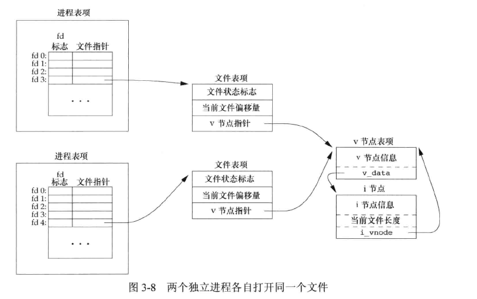

IO操作

------------

- [1. 不带缓冲的IO](#1-不带缓冲的io)
  - [1.1 文件描述符](#11-文件描述符)
  - [1.2 文件的创建，打开和关闭](#12-文件的创建打开和关闭)
    - [1.2.1 open函数](#121-open函数)
    - [1.2.2 create函数](#122-create函数)
    - [1.2.3 close函数](#123-close函数)
  - [1.3 文件读写](#13-文件读写)
    - [1.3.1 lseek函数](#131-lseek函数)
    - [1.3.2 read函数](#132-read函数)
    - [1.3.3 write函数](#133-write函数)
    - [1.3.4 读写的原子操作](#134-读写的原子操作)
    - [1.3.5 冲区相关操作函数](#135-冲区相关操作函数)
- [2. 内核中文件的表示方法](#2-内核中文件的表示方法)
- [3. 文件属性操作函数](#3-文件属性操作函数)
  - [3.1 dup和dup2](#31-dup和dup2)
  - [3.2 fcntl函数](#32-fcntl函数)
  - [3.3 ioctl函数](#33-ioctl函数)
- [4. 带缓冲的IO](#4-带缓冲的io)
  - [4.1 流和FILE对象](#41-流和file对象)
  - [4.2 缓冲](#42-缓冲)
  - [4.3 打开流](#43-打开流)
  - [4.4 关闭流](#44-关闭流)
  - [4.5 读写流](#45-读写流)
    - [4.5.1 非格式化IO](#451-非格式化io)
      - [单字符操作](#单字符操作)
      - [单行操作](#单行操作)
      - [二进制IO](#二进制io)
    - [4.5.2 流的错检验](#452-流的错检验)
    - [4.5.3 流的定位](#453-流的定位)
    - [4.5.4 格式化IO](#454-格式化io)
      - [格式化输出](#格式化输出)
      - [格式化输入](#格式化输入)
  - [4.6 临时文件](#46-临时文件)
  - [4.7 内存流](#47-内存流)
- [5. 高级IO](#5-高级io)
    - [非阻塞IO](#非阻塞io)

# 1. 不带缓冲的IO

  >不带缓冲的IO指的是这一章节介绍的读写操作都只是内核中的一个系统调用  
  >不带缓冲，并不是指内核不提供缓冲，而是只单纯的系统调用，不是函数库的调用。系统内核对磁盘的读写都会提供一个块缓冲（在有些地方也被称为内核高速缓存），当用write函数对其写数据时，直接调用系统调用，将数据写入到块缓冲进行排队，当块缓冲达到一定的量时，才会把数据写入磁盘。因此所谓的不带缓冲的I/O是指进程不提供缓冲功能（但内核还是提供缓冲的）。每调用一次write或read函数，直接系统调用。  
  >而带缓冲的I/O是指进程对输入输出流进行了改进，提供了一个流缓冲，当用fwrite函数网磁盘写数据时，先把数据写入流缓冲区中，当达到一定条件，比如流缓冲区满了，或刷新流缓冲，这时候才会把数据一次送往内核提供的块缓冲，再经块缓冲写入磁盘。（双重缓冲）  
  >因此，带缓冲的I/O在往磁盘写入相同的数据量时，会比不带缓冲的I/O调用系统调用的次数要少。  

- 无缓存IO操作数据流向路径：数据——内核缓存区——磁盘
- 标准IO操作数据流向路径：数据——流缓存区——内核缓存区——磁盘

## 1.1 文件描述符

- 文件描述符(file descriptor)，简称fd，也叫句柄。
- 每个文件都属于自己的句柄，例如标准输入是0，标准输出是1，标准出错是2。可用符号常量替换：STDIN_FILENO,STDOUT_FILENO,STDERR_FILENO，在头文件<unistd.h>中定义  
- 文件描述符的变化范围在0-OPEN_MAX-1内，

## 1.2 文件的创建，打开和关闭

### 1.2.1 open函数

```c
包含的头文件：
#include<fcntl.h> //在centos6.0中只要此头文件就可以
#include<sys/types.h>
#incldue<sys/stat.h>

int open(const char *pathname,int flags);
int open(const char *pathname,int flags,mode_t mode);
int openat(int fd, const char *pathname, int flags);
int openat(int fd, const char *pathname, int flags, mode_t mode);
//成功返回的文件描述符一定是最小的而且没有被使用的，失败返回-1
```

- open系列函数参数说明
  - pathname：要打开或创建的文件的路径
  - flags：用下面的一个或者多个常量进行“或”运算得到的参数
    - 主要参数，必须且只能指定一个：
      - O_RDONLY: 只读打开
      - O_WRONLY: 只写打开
      - O_RDWR: 读，写打开
      - O_EXEC：只执行打开
      - O_SEARCH: 只搜索打开(应用于目录)
    - 次要参数：可以和主要参数配合使用 

      |    参数     |                                                                                                                                                                      描述                                                                                                                                                                       |
      | :---------: | :---------------------------------------------------------------------------------------------------------------------------------------------------------------------------------------------------------------------------------------------------------------------------------------------------------------------------------------------: |
      |  O_APPEND   |                                                                                                                              追加写，如果文件已经有内容，这次打开文件所写的数据附加到文件的末尾而不覆盖原来的内容                                                                                                                               |
      |  O_CLOEXEC  | 在打开文件的时候，就为文件描述符设置FD_CLOEXEC标志。这是一个新的选项，用于解决在多线程下fork与用fcntl设置FD_CLOEXEC的竞争问题。某些应用使用fork来执行第三方的业务，为了避免泄露已打开文件的内容，那些文件会设置FD_CLOEXEC标志。但是fork与fcntl是两次调用，在多线程下，可能会在fcntl调用前，就已经fork出子进程了，从而导致该文件句柄暴露给子进程 |
      |   O_CREAT   |                                                                                                              若文件不存在，则创建它，需要使用mode选项来指明新文件的访问权限。如果没有指定这个选项，并且文件不存在，会返回错误消息                                                                                                               |
      |   O_EXCL    |                                                                                                               如果使用O_CREAT选项且文件存在，则返回错误消息。可用于测试一个文件是否存在，如果不存在则创建此文件。是一个原子操作。                                                                                                               |
      |  O_NOCTTY:  |                                                                                                                                           如果文件为终端设备，那么不将该设备分配作为此进程的控制终端                                                                                                                                            |
      | O_NOFOLLOW  |                                                                                                                                                          如果引用的是符号链接，则出错                                                                                                                                                           |
      | O_NONBLOCK  |                                                                                                                                                 将该文件描述符设置为非阻塞的（默认都是阻塞的）                                                                                                                                                  |
      |   O_SYNC    |                                                                                                                                  设置为I/O同步模式，每次进行写操作时都会将数据同步到磁盘，然后write才能返回。                                                                                                                                   |
      |   O_TRUNC   |                                                                                                                                               如果文件已经存在则删除文件中原有数据，将长度截断为0                                                                                                                                               |
      | O_LARGEFILE |                                                                                                                                                               表明文件为大文件。                                                                                                                                                                |
      |  O_NOATIME  |                                                                                                                                                     读取文件时，不更新文件最后的访问时间。                                                                                                                                                      |
      |  O_DIRECT   |                                                                                                                                                     对该文件进行直接I/O，不使用VFS Cache。                                                                                                                                                      |
      | O_DIRECTORY |                                                                                                                                                            要求打开的路径必须是目录                                                                                                                                                             |
  - mode：用八进制数指定文件访问权限，要注意真正建文件时的权限会受到umask值所影响，因此该文件权限应该为（mode-umaks）。
  >1 可执行权限
  >2 可写权限
  >4 可读权限
  >同时指定文件所有者、文件所在用户组、其他用户的权限
  >例如：指定0777说明想让三者都具有所有的权限，但是由于umask一开始是002，所以创建出来的权限不是777，而是775
- openat函数参数
  - 如果path参数指定的是绝对路径名，fd参数被忽略，openat函数相当于opan函数
  - 如果path参数指定的是相对路径名，fd参数指出相对路径名在文件系统中的开始地址，可以通过打开相对路径名所在的目录来获取。
  - 如果path参数是相对路径名，fd参数是常量AT_FDCWD,表明相对路径名从当前目录开始
- TOCTTOU错误
  - time of check to time of use, openat函数可以避免这一错误
  - 如果有两个基于文件的函数调用，其中第二个调用依赖于第一个调用的结果，那么程序就容易出错。因为这两个调用不是原子操作，在两个函数调用之间文件可能改变了，导致第一个调用的结果不再有效。

### 1.2.2 create函数

```c
#include <sys/stat.h>
#include <fcntl.h>
int creat(const char *pathname ,mode_t mode)
//是open的一种封装实现, 等价于 open（pathname，O_WRONLY|O_CREAT|O_TRUNC，mode)
```

### 1.2.3 close函数

```c
#include<unistd.h>
int close(int fd)
//成功：返回0；失败：返回-1，并设置errno
//当一个进程终止时，内核会自动关闭它所有的打开文件
```

## 1.3 文件读写

* 当前文件偏移量：度量从文件开始处计算的字节数，通常是非负整数，文件的读写操作都是从当前文件偏移量处开始，并使偏移量增加所读写的字节。
* 打开文件时系统默认设为0，除非指定O_APPEND选项

### 1.3.1 lseek函数

```c
#include <unistd.h>
off_t lseek(int fd, off_t offset, int whence);
//成功返回新的文件偏移量，出错返回-1，并设置errno
//只修改文件表项中的当前文件偏移量，不进行任何的IO操作
```

* 参数说明：
  * 若whence是SEEK_SET(值为0)， 则将该文件的偏移量设置为据文件开始处offset个字节
  * 若whence是SEEK_CUR(值为1)， 则将该文件的偏移量设置为当前值加offset个字节，offset参数可正可负
  * 若whence是SEEK_END(值为2) ，则将该文件的偏移量设置为文件长度加offset个字节，offset参数可正可负
  * 如果打开的文件(例如管道，FIFO,网络套接字)不可以设置偏移量，则返回-1，并将errno设置为ESPIPE
* 文件偏移量可以大于文件的当前长度，对该文件的下一次写将加长该文件，并在文件中构成空洞，空洞中的字节都默认为0.空洞部分并不要求在磁盘上占用存储区。

### 1.3.2 read函数

```c
#include <unistd.h>
ssize_t read (int fd, void *buf, size_t nbytes);
//成功返回读到的字节数，如果已到文件尾部，返回0，出错则返回-1
```

* 实际读的字节数少于要求读的字节数的情况：
  * 普通文件，在读到要求字节数之前到达了文件尾端
  * 从终端设备读时，通常一次最多读一行
  * 从网络读时，网络中的缓冲机制造成返回值小于所要求读的字节数
  * 从管道或FIFO中读时，管道包含的字节数小于所需的量
  * 读取某些面向记录的设备时，一次最多返回一个记录
  * 信号造成中断

### 1.3.3 write函数

```c
#include <unistd.h>
ssize_t write(int fd, const void *buf, size_t nbytes);
//成功返回已写的字节数，失败返回-1
```

- 返回值通常等于给定的字节数，否则表示出错
- 对于普通文件，写操作从文件的当前偏移量处开始，如果指定了O_APPEND则在写操作之前将文件偏移量设置在文件的当前结尾处

### 1.3.4 读写的原子操作

```c
#include <unistd.h>

```


### 1.3.5 冲区相关操作函数

* UNIX系统在内核中设有缓冲区高速缓存或页缓存，大多数磁盘IO通过缓冲区进行。
* 向文件写入数据时，内核会先将数据复制到缓冲区中，然后排入队列，晚些时候再写入磁盘。称为延迟写。

```c
#include <unistd.h>
int fsync(int fd);
int fdatasync(int fd);
//成功返回0出错返回-1
void sync(void);
```

* sync将所有修改过的块缓冲区排入些队列，然后就返回，并不等待实际写磁盘操作结束
  * update系统守护进程会周期性地调用sync函数(一般每隔30秒)，保证了定期冲洗内核的块缓冲区
* fsync只对fd指定的文件起作用，并且会等待写磁盘操作结束才返回
* fdatasync只影响文件的数据部分，不同步更新文件的属性(fsync会)

# 2. 内核中文件的表示方法

内核中共有3种数据结构表示打开的文件  
  


1. **进程表项**：每个进程在进程表中包含一个记录项，包含一张打开文件描述符表，记录了打开的文件的*文件描述符标志*和指向文件表项的指针
2. **文件表项**：所有的打开文件都有一张文件表，包含着*文件状态标志*、当前文件的偏移量、指向该文件v节点表项的指针
3. **v节点表项**：每个打开文件(或设备)都有一个v节点结构。包含了文件类型和对此文件进行各种操作函数的指针。对于大多数文件，v节点还包含了该结点的i节点，这些信息在打开文件时从磁盘中读入内存。

>可能有多个文件描述符项指向同一文件表项，最常见的情况时fork后父进程和子进程各自的每一个打开文件描述符共享同一个文件表项，dup函数也会导致这一现象的发生
>文件描述符标志和文件状态标志的作用范围存在区别，前者只用于一个进程的一个描述符，后者则应用于指向该给的那个文件表项的任何进程中的所有描述符

# 3. 文件属性操作函数

## 3.1 dup和dup2

* 用于复制一个现有的文件描述符

```c
#include <unistd.h>
int dup(int fd);
int dup2(int fd, int fd2);
//若成功返回新的文件描述符，失败则返回-1
```

* dup中返回的新的文件描述符一定是当前可用文件描述符中的最小值
* dup2中可用fd2指定了新描述符的值，如果fd2已经打开，则先将其关闭，如果fd2等于fd，则直接返回fd2
* 返回的新文件描述符与参数fd共享同一个文件表项

## 3.2 fcntl函数

* 用于改变已打开文件的属性

```c
#include <unistd.h>
#include <fcntl.h>
int fcntl(int fdm, int cmd, int arg)
//出错返回-1，成功返回某个值(和cmd有关)
```

* fcntl函数有5种功能：
  1. 复制一个现有的描述符（cmd=F_DUPFD或F_DUPFD_CLOEXEC).
  2. 获得／设置文件描述符标记(cmd=F_GETFD或F_SETFD)，进程表项中.
  3. 获得／设置文件状态标记(cmd=F_GETFL或F_SETFL)，文件表项中.  
  4. 获得／设置异步I/O所有权(cmd=F_GETOWN或F_SETOWN).  
  5. 获得／设置记录锁(cmd=F_GETLK,F_SETLK或F_SETLKW).  
* cmd共有11个选项：
  1. F_DUPFD
  2. F_DUPFD_CLOEXEC
  3. F_GETFD
  4. F_SETFD
  5. F_GETFL
  6. F_SETFL
  7. F_GETOWN
  8. F_SETOWN

## 3.3 ioctl函数

# 4. 带缓冲的IO

* 不带缓冲的IO函数都是围绕文件描述符进行的
* 对于带缓冲的标准IO函数，操作是围绕流进行的

## 4.1 流和FILE对象

* ASCII字符集中一个字符用一个字节表示,在国际字符集中一个自读可用多个字节表示.因此标准IO的文件流可用于单字节或多字节(宽)字符集。
* 流的定向决定了所读写的字符是单字节还是多字节。流最初被创建时是未定向的，若要在未定向的流上使用单字节IO函数，需要将流设为字节定向。反之则要设置为宽定向。

```c
#include <stdio.h>
#include <wchar.h>
int fwide(FILE *fp, int mode);
//若流是宽定向的，返回正值
//若流是字节定向的，返回负值
//若流是未定向的，返回0
```

* fwide函数用于设置流的定向，根据mode参数的不同值，执行不同的工作
  * 如果mode参数值为负，则试图使指定的流是字节定向的。
  * 如果mode参数值为正，则试图使指定的流是宽定向的。
  * 如果mode参数值为0，则不设置流的定向，但返回标识该流定向的值。
* **并不改变已定向流的定向**

## 4.2 缓冲

* 标准IO提供了3种类型的缓冲
  * 全缓冲。只有在填满标准IO缓冲区后才进行实际IO操作。在磁盘中的文件通常是全缓冲的。
    * 当在一个流上执行第一次IO操作时，通常需要调用malloc获得需使用的缓冲区
    * 调用flush主动将缓冲区的内容写到磁盘中。标准IO会自动调用flush。
  * 行缓冲。当在输入和输出中遇到换行符时，执行IO操作。当流涉及终端操作时(如标准输入和输出)，通常使用行缓冲。
    * 标准IO库用来收集每一行的缓冲区的长度是固定的，如果缓冲区填满了，即使没有遇到换行符，也要进行IO操作
    * 在任何时候只要通过标准IO库要求从一个不带缓冲的流或一个行缓冲的流中得到输入数据时，会冲洗所有的行缓冲输出流。
  * 不带缓冲。不对字符进行缓冲存储。标准错误流通常是不带缓冲的，使得出错信息可以尽快显示出来。
* 系统默认的缓冲类型
  * 标准错误是不带缓冲的
  * 指向终端设备的流是行缓冲的，否则是全缓冲

```c
#include <stdio.h>
void setbuf(FILE* fp, char* buf);
int setvbuf(FILE* fp, char* buf,int mode,size_t size);
//成功返回0，出错返回非0
```

* setbuf打开或关闭缓冲机制。打开缓冲时，buf必须指向一个长度为BUFSIZE的缓冲区(定义在<stdio.h>中)。通常在此之后该流就是全缓冲的，但如果该流与一个终端设备相关，则将其设置为行缓冲。关闭缓冲时，将buf设置为NULL
* setvbuf可以通过mode参数精确地说明所需的缓冲类型
  * _IOFBF，全缓冲
  * _IOLBF，行缓冲
  * _IONBF，不带缓冲，忽略buf和size参数
  * 指定全缓冲和行缓冲时，buf和size可选择地指定一个缓冲区及其长度，如果buf为NULL，则标准IO库会自动为该流分配长度合适的缓冲区(通常由BUFSIZE指定)
* 一般而言让系统选择缓冲区的长度，并自动分配缓冲区，这样的话关闭流时，标准IO库会自动释放缓冲区。否则需要自己释放分配的缓冲区。

```c
#include <stdio.h>
int fflush(FILE *fp);
//成功返回0，出错返回EOF
```

* fflush将所有未写的数据都被传送到内核。
* 如果fp时NULL,则冲洗所有的输出流

## 4.3 打开流

```c
#include <stdio.h>
FILE *fopen(const char* pathname, const char *type);
FILE *freopen(const char *pathname, const char * type, FILE * fp);
FILE *fdopen(int fd, const char *type);
//成功返回文件指针，出错返回NULL
int fileno(FILE *fp);
//返回与流相关的文件描述符
```

* fopen打开路径名为pathname的文件
* freopen在一个指定的流上打开一个指定的文件。如果该流已经打开，则先关闭流。如果该流已经定向，则会清除该定向。此函数一般用于将一个指定的文件打开一个预定义的流，例如标准输入输出等
* fdopen将一个标准的IO流与指定文件描述符相结合。常用于由创建管道和网络通信通道函数返回的描述符。因为这些特殊类型的文件不能用fopen打开，必须先获得一个文件描述符后操作。
* type参数指定对流的读写方式，共有15种取值
  |     type     |              说明              |       等价的open标志        |
  | :----------: | :----------------------------: | :-------------------------: |
  |    r或rb     |           为读而打开           |          O_RDONLY           |
  |    w或wb     |     为写而创建，截断至0长      | O_WRONLY\|O_CREAT\|O_TRUNC  |
  |    a或ab     |   为写而创建，在文件尾开始写   | O_WRONLY\|O_CREAT\|O_APPEND |
  | r+或r+b或rb+ |         为读和写而打开         |           O_RDWR            |
  | w+或w+b或wb+ |   为读和写而打开，截断至0长    |  O_RDWR\|O_CREAT\|O_TRUNC   |
  | a+或a+b或ab+ | 为在文件尾写读和写而打开或创建 |  O_RDWR\|O_CREAT\|O_APPEND  |

## 4.4 关闭流

```c
#include<stdio.h>
int fclose(FILE *fp);
//成功返回0，出错返回EOF 
```

* 关闭之前会冲洗缓冲区中的输出数据，丢弃输入数据
* 同时如果该流的缓冲区是标准IO库自动分配的，标准IO库还会自动释放此缓冲区
* 当一个进程正常终止时，所有带未写缓冲数据的标准IO流都被冲洗，所有打开的标准IO流都被关闭

## 4.5 读写流

### 4.5.1 非格式化IO

* 有三种读写类型
  * 每次一个字符
  * 每次一行
  * 二进制IO(每次读写一个完整的结构)

#### 单字符操作

```c
#include <stdio.h>
int getc(FILE *fp);
int fgetc(FILE *fp);
int getchar();//等于getc(stdin);
//成功返回下一个字符，若已到达文件尾端或出错，返回EOF
```

* 这三个函数用于一次读一个字符
* getc可被实现为宏，fgetc不行，意味着
  * getc的参数不应当是具有副作用的表达式，因为它可能被计算多次
  * fgetc一定是一个函数，可以得到其地址，允许将fgetc的地址作为函数参数
  * 调用fgetc所需的时间可能比调用getc要长

```c
#include <stdio.h>
int ungetc(int c, FILE *fp);
//成功返回c，出错返回EOF
```

* 把字符再压送回流中，并没有写到文件或设备中，只是写回了流缓冲区中
* 回送的字符不一定必须是上一次读到的字符，不能回送EOF
* 已经到达文件尾端时，仍可以回送一个字符，下次读将返回该字符，再读则返回EOF
* 一次成功的ungetc会清除该流的文件结束标志

```c
#include <stdio.h>
int putc(int c, FILE *fp);
int fputc(int c, FILE *fp);
int putchar();
//成功返回c,出错返回EOF
```

* 用于写字符，类似上面的三个写函数

#### 单行操作

```c
#include <stdio.h>
char *fgets(char *buf, int n, FILE *fp);
char *gets(char *buf);
//成功返回buf,若已到达文件尾端或出错，返回NULL
```

* gets从标准输入读，fgets从指定的流读
* fgets指定了缓冲的长度n,这个函数一直读到下一个换行符为止，但是不超过n-1个字符。读入的字符送入buf中，以null字节结尾。如果该行包括最后一个换行符的字符数超过了n-1，则fgets只会返回一个不完整的行。buf总是会以null字节结尾，这种情况下fgets的下一次调用会继续该行
* fgets会保留换行符，而gets会删除换行符

>gets不建议使用，因为没有指定buf的长度，当要读取的行长于buf长度时，会造成缓冲区溢出，产生不可预料的后果

```c
#include <stdio.h>
int fputs(const char * str, FILE *fp);
int puts(const char *str);
//成功返回非负值,出错返回EOF
```

* fputs将一个以null字节终止的字符串写到指定的流，尾端的终止符null不写出。不要求null之前是一个换行符。最后也不会添加一个换行符。
* puts写到标准输出，终止符不写出，随后会添加一个换行符。

#### 二进制IO

```c
#include <stdio.h>
size_t fread(void *ptr, size_t size, size_t nobj,FILE *fp);
size_t fwrite(const void *ptr, size_t size, size_t nobj, FILE *fp);
//返回读或写的对象数
```

* size为每个对象的长度，nobj为要读/写的对象个数
* fread，如果出错或者到达文件尾端，则此数字可能少于nobj
* fwrite如果写入的值少于nobj,则一定是出错

### 4.5.2 流的错检验

```c
#include <stdio.h>
int ferror(FILE *fp);
int feof(FILE *fp);
//条件为真，返回非0，否则返回0
void clearerr(FILE *fp);
```

* 每个流在FILE对象中维护了两个标志，出错标志和文件结束标志，可分别用ferror和feof检验
* clearerr可以清除这两个标志

### 4.5.3 流的定位

有三组函数，区别是用不同的整型标识文件偏移量，最好使用第三组，可移植性强

```c
#include <stdio.h>
long ftell(FILE *fp);//成功返回当前文件位置，出错返回-1
int fseek(FILE *fp,long offset, int whence);//成功返回0，出错返回-1
void rewind(FILE *fp);
```

* 假定的文件的偏移量可以存放在一个长整型中
* ftell得到文件当前的偏移量，rewind将流设置到文件的起始位置
* fseek中whence的值有三个
  * SEEK_SET，从文件起始位置开始
  * SEEK_CUR，从文件当前位置开始
  * SEEK_END，从文件尾端开始

>对于一个文本文件，它们的文件当前位置可能不以简单的字节偏移量来度量。为了定位一个文本文件，whence一定要是SEEK_SET，offset只能为0或者是对该文件调用ftell返回的值

```c
#include <stdio.h>
off_t ftello(FILE *fp);
//成功返回当前文件位置，出错返回(off_t)-1
int fseeko(FILE* fp, off_t offset, int whence);
//成功返回0，出错返回-1
```

* 偏移量的类型是off_t

```c
#include <stdio.h>
int fgetpos(FILE* fp, fpos_t *pos);
int fsetpos(FILE *fp, cost fpos_t *pos);
//成功返回0，出错返回非0
```

* 用一个抽象类型数据fpos_t记录文件的位置
* 将文件位置指示器的当前值存入由pos指向的对象中

### 4.5.4 格式化IO

#### 格式化输出

```c
#include <stdio.h>
int printf(const char * format, ...);
int fprintf(FILE *fp, const char *format, ...);
int dprintf(int fd, const char *format, ...);
//上面三个函数成功返回输出字符数，出错则返回负值
int sprintf(char * buf, const char *format, ...);
//成功返回存入数组的字符数，编码出错则返回负值
int snprintf(char *buf, size_t n, const char * format, ...);
//若缓冲区足够大，则返回将要存入数组的字符数，编码出错则返回负值

//将可变参数列表替换成va_list格式，得到类似的5个函数
int vprintf(const char * format, va_list arg);
int vfprintf(FILE *fp, const char *format, va_list arg);
int vdprintf(int fd, const char *format, va_list arg);
//成功返回输出字符数，出错则返回负值
int vsprintf(char * buf, const char *format, va_list arg);
//成功返回存入数组的字符数，编码出错则返回负值
int vsnprintf(char *buf, size_t n, const char * format, va_list arg);
```

- printf将格式化数据写到标准输出，fprintf写到指定的流，dprintf写到指定的文件描述符
- sprintf将格式化的字符送入数组buf中，会在数组的尾端自动加上一个null字节，但该字符不包括在返回值中。可能会造成buf指向的缓冲区的溢出
- snprintf中指定了缓冲区的长度，超过缓冲区尾端写的所有字符都被丢弃。同样会在数组的尾端自动加上一个null字节，并且该字符不包括在返回值中
- format格式。转化说明以百分号开始，其他字符按原样输出。
- 转换说明格式 `%[flags][fldwidth][precision][lenmodifier]convtype`
  - flags主要有

  | flags |                       说明                       |
  | :---: | :----------------------------------------------: |
  |   '   |               将整数按千位分组字符               |
  |   -   |           左对齐,默认输出格式是右对齐            |
  |   +   |            总是显示带符号转换的正负号            |
  | 空格  | 如果第一个字符不是正负号，则在其前面加上一个空格 |
  |   #   |                指定另一种转换形式                |
  |   0   |                添加前导0进行填充                 |

  - fldwidth说明最小字段宽度。转换后参数字符若小于宽度，则多余字符位置用空格填充。若参数字符长于宽度，则无意义。表示方法是 一个非负十进制数或是一个星号(*)
  - precision说明整型转换后最少输出数字位数(如果整数不够长，会加前导0，整数过长无影响)、浮点数转换后小数点后的最小位数(如果小数部分不够长，会在后面加0,小数部分太长则发生截断)、字符串转换后最大字节数(字符过长会截断)。表示方法是 一个点(.)，其后跟随一个可选的非负十进制数或一个星号(*)。
  > fldwidth和precision字段均为\*时，用一个整型参数指定宽度或精度的值，该整型参数位于被转换的参数之前,例如 printf %\*.\*f 4 1 1.213123
  - lenmodifier说明参数长度，可能的值包含有

  | 长度修饰符 |                          说明                          |
  | :--------: | :----------------------------------------------------: |
  |     hh     |                 signed或unsigned char                  |
  |     h      |                 signed或unsigned short                 |
  |     l      |             signed或unsigned long或宽字符              |
  |     ll     |               signed或unsigned long long               |
  |     j      | intmax_t或uintmax_t,最大的整数和最大的无符号整数的格式 |
  |     z      |                         size_t                         |
  |     t      |                       ptrdiff_t                        |
  |     L      |                      long double                       |

  * convtype必须存在，控制着如何解释参数，可能的值包含有

  | 转换类型 |                           说明                           |
  | :------: | :------------------------------------------------------: |
  |   d,i    |                       有符号十进制                       |
  |    u     |                       无符号十进制                       |
  |    o     |                       无符号八进制                       |
  |   x,X    |                      无符号十六进制                      |
  |   f,F    |          双精度浮点数，默认的小数点后精度是6位           |
  |   e,E    |                  指数格式的双精度浮点数                  |
  |   g,G    |                    根据值自动选择f或e                    |
  |   a,A    |              十六进制指数格式的双精度浮点数              |
  |    c     |                  字符，若lc则代表宽字符                  |
  |    s     |                  字符串，ls代表宽字符串                  |
  |    p     |                           指针                           |
  |    n     | 把此printf调用输出的字符的数目写到一个带符号整型的指针中 |
  |    %     |                        输出一个%                         |
  |    C     |                         等效于lc                         |
  |    S     |                         等效于ls                         |

#### 格式化输入

```c
#include <stdio.h>
int scanf(const char* format,...);
int fscanf(FILE *fp, const char * format,...);
int sscanf(const char* buf, const char *format,...);
//返回赋值的输入项数，如果输入出错或在任一转换前已到达文件尾端，返回EOF

int vscanf(const char* format, va_list arg);
int vfscanf(FILE *fp, const char * format, va_list arg);
int vsscanf(const char* buf, const char *format, va_list arg);

```

* 用于分析输入字符串，并将字符串序列转换成指定类型的变量。
* 在格式之后的各参数中包含了变量的地址，用转换结果对这些变量赋值
* 格式说明控制如何转换参数。以%开始。除了转换说明和空白字符外，格式字符串中的其他字符必须与输入匹配
* 转换说明格式 `%[*][fldwidth][m][lenmodifier]convtype`
  * 星号(*)用于抑制转换，按照转换说明的其余部分对输入进行转换，但转换结果并不存放在参数中
  * fldwidth说明最大宽度(最大字符数)
  * m是赋值分配符，可用于%c,%s以及%[转换符，会在内存缓冲区中分配空间用以容纳转换字符串。分配成功的地址会复制给对应的参数。必须记得手动free
  * lenmodifier说明要用转换结果赋值的参数大小，可选的取值和printf中一样 
  * convtype说明转换格式

  | 转换类型 |                           说明                           |
  | :------: | :------------------------------------------------------: |
  |   d,i    |                       有符号十进制                       |
  |    u     |               无符号十进制,输入负数时会转                |
  |    o     |                       无符号八进制                       |
  |   x,X    |                      无符号十六进制                      |
  |   f,F    |          双精度浮点数，默认的小数点后精度是6位           |
  |   e,E    |                  指数格式的双精度浮点数                  |
  |   g,G    |                    根据值自动选择f或e                    |
  |   a,A    |              十六进制指数格式的双精度浮点数              |
  |    c     |                  字符，若lc则代表宽字符                  |
  |    s     |                  字符串，ls代表宽字符串                  |
  |    \[    |               匹配列出的字符序列，以\]终止               |
  |   \[^    |        匹配除列出的字符序列外的所有字符，以\]终止        |
  |    p     |                           指针                           |
  |    n     | 把此printf调用输出的字符的数目写到一个带符号整型的指针中 |
  |    %     |                        输出一个%                         |
  |    C     |                         等效于lc                         |
  |    S     |                         等效于ls                         |

## 4.6 临时文件

```c
#include <stdio.h>
char* tmpnam(char *ptr);
//返回指向唯一路径名的指针
FILE* tmpfile(void);
//成功返回文件指针，出错返回NULL
```

* tmpnam函数产生一个与现有文件名不同的一个有效路径名字符串。每次调用时产生的都是一个不同的路径名，最多调用TMP_MAX次
  * 若ptr为空，则所产生的路径名存放在一个静态区中，指向该静态区的指针作为函数值返回。后续调用tmpname时会重写该静态区。因此如果多次调用函数，并且想保存该路径名的副本，需要复制该路径名，而不是保存指针的副本
  * ptr不为空时，所产生的路径名存放在ptr中
  * 得到路径名后需要手动创建文件，这期间不同进程和线程之间可能会存在竞争关系，最好使用tmpfile函数
* tmpfile创建一个类型为wb+的临时二进制文件。在关闭该文件或程序结束时会被自动删除

```c
#include <stdlib.h>
char *mkdtemp(char *template);
//成功返回指向目录名的指针，出错返回NULL
int mkstemp(char *template);
//成功返回文件描述符，出错返回-1
```

* mkdtemp函数创建一个目录，该目录有一个唯一的名字，访问权限为S_IRUSR|S_IWUSR|S_IXUSR
* mkstemp创建一个文件，同样有唯一的名字，访问权限为S_IRUSR|S_IWUSR，不会自动删除，需要手动解除链接
* template字符串以XXXXXX(6个X)结尾，函数会将这个占位符替换成不同的字符来构建一个唯一的路径名。

## 4.7 内存流

# 5. 高级IO

### 非阻塞IO


