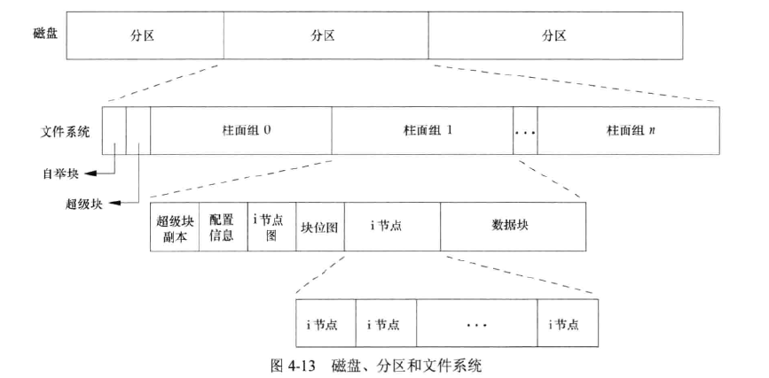

# 文件和目录

- [文件和目录](#文件和目录)
  - [stat及其相关函数](#stat及其相关函数)
  - [文件类型介绍](#文件类型介绍)
  - [用户ID和组ID](#用户id和组id)
    - [access和faccessat函数](#access和faccessat函数)
    - [更改文件用户ID和组ID](#更改文件用户id和组id)
  - [文件访问权限](#文件访问权限)
    - [umask函数](#umask函数)
    - [chmod, fchmod和fchamodat](#chmod-fchmod和fchamodat)
    - [设置用户ID和设置用户组ID](#设置用户id和设置用户组id)
    - [粘着位介绍](#粘着位介绍)
  - [文件的长度和截断](#文件的长度和截断)
  - [文件系统](#文件系统)``


## stat及其相关函数

* fstat函数获得的是对应文件描述符的打开文件的信息
* 当一个文件是符号链接时，lstat 函数返回的是该符号链接本身的信息；而 stat 函数返回的是该链接指向文件的信息。
* fstatat函数为一个相对于目录（由fd参数指定，AT_FDCWD表明相对于当前目录）的路径名返回文件结构信息。flag参数控制是否跟随符号链接，当AT_SYMLINK_NOFOLLOW标志被设置时，不会跟随符号链接，返回符号链接本身的信息。默认情况下返回的是符号链接所指向的实际文件的信息。

```c
#include <sys/stat.h>
int stat(const char *path, struct stat *buf);
int fstat(int fd, struct stat *buf);
int lstat(const char *path, struct stat *buf);
int fstatat(int fd, const char *path,struct stat *buf, int flag );
//成功返回0，出错返回-1

struct stat {
    mode_t              st_mode;       //文件对应的模式，文件，目录等
    ino_t               st_ino;        //inode节点号
    dev_t               st_dev;        //设备号码
    dev_t               st_rdev;       //特殊设备号码
    nlink_t             st_nlink;      //文件的连接数
    uid_t               st_uid;        //文件所有者
    gid_t               st_gid;        //文件所有者对应的组
    off_t               st_size;       //普通文件，对应的文件字节数
    struct timespec     st_atime;      //文件最后被访问的时间
    struct timespec     st_mtime;      //文件内容最后被修改的时间
    struct timespec     st_ctime;      //文件状态改变时间
    blksize_t           st_blksize;    //文件内容对应的块大小
    blkcnt_t            st_blocks;     //文件内容对应的块数量
};
struct timespec{
    time_t tv_sec; //秒
    long tv_nsec;  //纳秒
};
```

## 文件类型介绍

1. 普通文件，S_ISREG()
2. 目录文件, S_ISDIR()
3. 块特殊文件。S_ISCHR(),提供对设备带缓冲的访问，每次访问以固定长度为单位进行
4. 字符特殊文件，S_ISBLK(),提供对设备不带缓冲的访问，每次访问长度可变
5. FIFO，命名管道,S_ISFIFO()
6. 套接字，主要用于网络通信,S_ISSOCK()
7. 符号链接,S_ISLINK()

* 对stat结构中的st_mode用宏判断，可以得到对应的文件类型，例如`S_ISREG(st_mode)`
* 对指向stat的指针用下列宏，可以判断进程间通信的对象，对这些对象的详细介绍见
  * S_TYPEISMQ()，消息队列
  * S_TYPEISSEM()， 信号量
  * S_TYPEISSHM()，共享存储对象

## 用户ID和组ID

* 实际用户ID和实际组ID, 标识我们是谁，取自口令文件中的登录项
* 有效用户ID,有效组ID，附属组ID，控制文件访问权限
* 保存的设置用户ID和保存的设置组ID，在执行一个程序时包含了有效用户ID和有效组ID的副本
* 每个文件都有一个所有者和组所有者，由stat结构中的st_uid和st_gid指定
* 每个进程通常有效用户ID就是实际用户ID，有效组ID就是实际组ID。但是在文件的st_mode中，可以设置一个设置用户ID位，表示“当执行此文件时，将进程的有效用户ID设置成文件所有者的用户ID”,还有类似的设置组ID位。这两位可用宏S_ISUID和S_ISGID测试。

### access和faccessat函数

```c
#include <unistd.h>
int access (const char* pathname, int mode);
//pathname是文件的路径，mode含义如下
int faccessat(int fd, const char* pathname, int moe, int flag);
//相对于打开目录(由fd指向)的pathname
//成功返回0，出错返回-1
```

* 这俩个函数按照实际用户ID和实际组ID进程权限测试，在默认的条件下是用进程的有效用户ID和有效组ID进程测试的
* mode的取值是以下常量的或
  * R_OK，测试读权限
  * W_OK，测试写权限
  * X_OK，测试执行权限
  * F_OK，测试文件是否存在
* 如果faccessat中的flag参数被设置为AT_EACCESS,检查的是用效ID

### 更改文件用户ID和组ID

```c
#include <unistd.h>
int chown(const char *pathname, uid_t owner, gid_t group);
int fchown(int fd, uid_t owner, gid_t group);
int fchownat(int fd, const char* pathname, uid_t owner, gid_t group, int flag);
int lchown(const char* pathname, uid_t owner, gid_t group);
成功返回0，出错返回-1
```

* 在文件是符号链接的情况下，lchown和设置了AT_SYMLINK_NOFOLLOW标志的fchownat更改符号链接本身的所有者，其他函数更改符号链接所指向的文件的所有者
* 只有超级用户进程可以更改文件的用户ID
* 普通用户更改自己所拥有的文件的组ID，但只能改到自己所在的组，这种情况时参数owner取-1或者文件的用户ID
* 如果函数由非超级用户进程调用，那么在成功返回时，该文件的设置用户ID位和设置组ID位都被清除

## 文件访问权限

* 每个文件有9个访问权限位，用户USR/组GRP/其他OTH 读IR/写IW/执行IX 组合而成，用宏S_IRUSR等判断。也可用3个八进制数表示，4/2/1分别表示读/写/执行,
* 对目录的特殊规则
  * 目录的读权限只允许获得在该目录中所有文件名的列表，只有可执行权限才能通过该目录，因此打开任一类型的文件时，对路径中包含的每一个目录，都要有可执行的权限
  * 在目录中创建一个新文件，需要有该目录的写权限和执行权限
  * 删除一个文件，必须对包含该文件的目录具有写权限和执行权限，对文件本身不需要什么权限
* 判断进程对文件拥有的权限，按以下的先后顺序判断
  * 进程的有效用户是0(超级用户)，则允许访问
  * 进程的有效用户ID等于文件的所有者ID，如果所有者适当的访问权限位被设置，则允许访问
  * 有效组ID或附属组ID等于文件组ID，获得组的访问权限
  * 获得其他用户的访问权限
* 用open或create创建的新文件和目录的ID
  * 新文件的用户ID设置位进程的有效用户ID
  * 组ID可以是进程的有效组ID，也可以是它所在目录的组的ID，默认情况下，如果新文件所在的目录的设置组ID位被设置，则新文件的设置位目录的组ID，否则设置为进程的有效组ID

### umask函数

```c
#include <sys/stat.h>
mode_t umask(mode_t cmask);
//返回之前的文件模式创建屏蔽字，没有出错返回
```

* cmask的取值为S_IRUSR等9个常量的或
* 在进程调用open或create创建文件时，文件的实际访问权限为mode-cmask
* 系统默认的umask值在登录时由shell的启动文件设置
* 更改进程的文件模式常见屏蔽字不影响其父进程的屏蔽字

### chmod, fchmod和fchamodat

```c
#include <sys/stat.h>
int chmod(const char* pathname, mode_t mode);
int fchmod(int fd, mode_t mode);
int fchmodat(int fd, const char* pathname, mode_t mode, int flag);
//成功返回0，出错返回-1
```

* 用于更改现有文件的访问权限，fcnmodat参数的行为和fstatat函数一样
* 为了改变文件的权限位，进程的有效用户ID必须等于文件的所有者ID，或者进程必须具有超级用户权限
* mode的可能取值是以下15个常量的或
  * 常见的9个文件访问权限位，以及组成而成的S_IRWXU,S_IRWXG,S_IRWXO
  * S_ISUID，S_ISGID,设置用户ID位，设置组ID位
  * S_ISVTX, 保存正文常量，粘着位
* 只有超级用户才能设置普通文件的粘着位。其他情况下如果试图设置普通文件的粘着位，粘着位会自动关闭
* 如果新文件的组ID不等于进程的有效组ID或者进程符数组中的ID，而且进程没有超级用户权限，那么设置组ID位会被自动关闭。防止用户创建一个设置组ID文件，而该文件并非该用户所属组拥有的。在某些系统中，只有超级用户权限才能设置设置用户ID位和设置组ID位。


### 设置用户ID和设置用户组ID


### 粘着位介绍

* 如果可执行程序文件被设置了粘着位，那么当该程序第一次被执行，在其终止时，程序正文部分的一个副本仍被保存在交换区，使得下次执行该程序能较快地被载入内存
* 如果对目录这是粘着位，只有对该目录具有写权限的用户并且满足以下条件之一才能删除或重命名该目录下的文件。没有设置粘着位的话只需要目录的写和执行权限就行了
  * 拥有此文件
  * 拥有此目录
  * 是超级用户

## 文件的长度和截断

* stat结构成员st_size表示以字节为单位的文件的长度，只对普通文件，目录文件和符号链接有意义。部分系统对管道也定义了文件长度，表示可从该管道中读到的字节数
* 符号链接的长度是文件名中的实际字节数，且并不包含结尾的Null字节
* st_blksize是对文件IO合适的块长度
* st_blocks是所分配的实际512字节块块数（512这个值可能随着系统的改变而改变）
* 当文件的设置的偏移量超过文件尾端，并写入了某些数据后，会造成文件中存在空洞

```c
#include <unistd.h>
int truncate(const char* pathname,off_t length);
int ftruncate(int fd, off_t length);
//成功返回0，出错返回-1
//如果文件以前的长度大于length，则超过length以外的数据就不能再访问，如果以前的长度小于length，则文件长度增加，增加的部分数据都读作0，在文件中创建了一个空洞
```

## 文件系统

* 可以把磁盘分成一个或多个分区，每个分区都可以包含一个文件系统
* i节点是固定长度的记录项，包含有关文件的大部分信息
  * 每个i节点中都有一个链接计数，其值是指向该i节点的目录项数。只有当链接计数减少至0时，才可以删除该文件。在stat结构中，链接计数包含在st_nlink成员中。这种链接类型称为硬链接
  * i节点包含了文件有关的有关信息：文件类型，文件访问权限位，文件长度和指向文件数据库的指针等。stat结构中的发大多数信息都取自i节点。只有两项重要数据存放在目录项中，文件名和i节点编号
  * 目录项中的i节点编号只能指向同一文件系统中的响应i节点，不能跨越文件系统
* 符号链接文件，文件中的实际内容包含了该符号链接所指向的文件的名字




