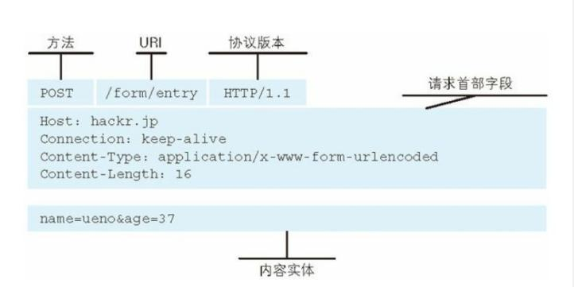
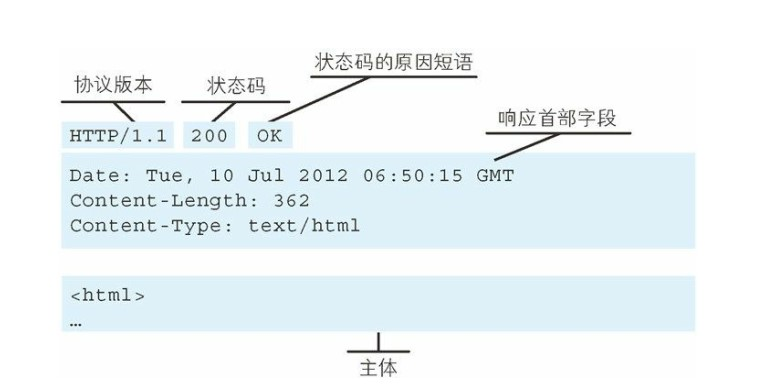

# 目录


## B/S和C/S模式
https://blog.csdn.net/wangsiu/article/details/78134880
https://www.jianshu.com/p/0bcaf0cebcd2
https://www.cnblogs.com/jingmin/p/6493216.html
* B/S(Browser/Server,浏览器/服务器)
    * 客户端统一采用浏览器如：Netscape和IE，通过Web浏览器向Web服务器提出请求，由Web服务器对数据库进行操作，并将结果传回客户端。
    * B/S结构简化了客户机的工作，但服务器将担负更多的工作，对数据库的访问和应用程序的执行都将在这里完成。即当浏览器发出请求后，其数据请求、加工、返回结果、动态网页生成等工作全部由Web服务器完成。
    * 工作原理：
        * 在B/S模式中，客户端运行浏览器软件。浏览器以超文本形式向Web服务器提出访问数据库的要求
        * Web服务器接受客户端请求后，将这个请求转化为SQL语法，并交给数据库服务器
        * 数据库服务器得到请求后，验证其合法性，并进行数据处理，然后将处理后的结果返回给Web服务器
        * Web服务器再一次将得到的所有结果进行转化，变成HTML文档形式，转发给客户端浏览器
        * 浏览器以友好的Web页面形式显示出来。
    * 特点　　
        * 系统开发、维护和升级的经济性：对于大型的管理信息系统，软件开发、维护与升级的费用是非常高的，BS模式所具有的框架结构可以大大节省这些费用，同时，BS模式对前台客户机的要求并不高，可以避免盲目进行硬件升级造成的巨大浪费。
        * B/S模式提供了一致的用户界面：B/S模式的应用软件都是基于Web浏览器的，这些浏览器的界面都很相似。对于无用户交互功能的页面，用户接触的界面都是一致的，从而可以降低软件的培训费用。
        * B/S模式具有很强的开放性: 在B/S模式下，外部的用户亦可通过通用的浏览器进行访问。B/S模式的结构易于扩展: 由于Web的平台无关性，BS模式结构可以任意扩展，可以从一台服务器、几个用户的工作组级扩展成为拥有成千上万用户的大型系统。
        * B/S模式具有更强的信息系统集成性: 在BS模式下，集成了解决企事业单位各种问题的服务，而非零散的单一功能的多系统模式，因而它能提供更高的工作效率。
        * B/S模式提供灵活的信息交流和信息发布服务: B/S模式借助Internet强大的信息发布与信息传送能力可以有效地解决企业内部的大量不规则的信息交流。


* C/S(Client/Server,客户/服务器)


### 概述
* HTTP协议是Hyper Text Transfer Protocol（超文本传输协议）的缩写，是用于从万维网（WWW:World Wide Web）服务器传输超文本到本地浏览器的传送协议。 
* HTTP是一个基于TCP/IP通信协议来传递数据（HTML 文件，图片文件，查询结果等）。 
* HTTP是一个属于应用层的面向对象的协议，由于其简捷、快速的方式，适用于分布式超媒体信息系统。 
* HTTP协议工作于客户端-服务端架构为上。浏览器作为HTTP客户端通过URL向HTTP服务端即WEB服务器发送所有请求。Web服务器根据接收到的请求后，向客户端发送响应信息。

**特点**  
* 简单快速。客户向服务器请求服务时，只需传送请求方法和路径。由于HTTP协议简单，使得HTTP服务器的程序规模小，因而通信速度很快。
* 灵活：HTTP允许传输任意类型的数据对象。正在传输的类型由Content-Type加以标记。  
* 无连接： 无连接的含义是限制每次连接只处理一个请求。服务器处理完客户的请求，并收到客户的应答后，即断开连接。采用这种方式可以节省传输时间。 
* 无状态： HTTP协议是无状态协议。无状态是指协议对于事务处理没有记忆能力。缺少状态意味着如果后续处理需要前面的信息，则它必须重传，这样可能导致每次连接传送的数据量增大。另一方面，在服务器不需要先前信息时它的应答就较快。 


### URI和URL
* URI,Uniform Resource Identifier,统一资源标识符
* URL,Uniform Resource Locator,统一资源定位符
* URI用字符串标识某一互联网资源，而URL表示资源的地点，URL是URI的子集
* 一个完整的URL包括以下几部分：
    1. 协议部分：URL的协议部分为“http：”，这代表网页使用的是HTTP协议。在Internet中可以使用多种协议，如HTTP，FTP等等本例中使用的是HTTP协议。在"HTTP"后面的“//”为分隔符
    2. 域名部分：该URL的域名部分为“www.cnblog.com”。一个URL中，也可以使用IP地址作为域名使用
    3. 端口部分：跟在域名后面的是端口，域名和端口之间使用“:”作为分隔符。端口不是一个URL必须的部分，如果省略端口部分，将采用默认端口
    4. 虚拟目录部分：从域名后的第一个“/”开始到最后一个“/”为止，是虚拟目录部分。虚拟目录也不是一个URL必须的部分。本例中的虚拟目录是“/news/”
    5. 文件名部分：从域名后的最后一个“/”开始到“？”为止，是文件名部分，如果没有“?”,则是从域名后的最后一个“/”开始到“#”为止，是文件部分，如果没有“？”和“#”，那么从域名后的最后一个“/”开始到结束，都是文件名部分。本例中的文件名是“index.php”。文件名部分也不是一个URL必须的部分，如果省略该部分，则使用默认的文件名
    6. 锚部分：从“#”开始到最后，都是锚部分。本例中的锚部分是“name”。锚部分也不是一个URL必须的部分
    7. 参数部分：从“？”开始到“#”为止之间的部分为参数部分，又称搜索部分、查询部分。本例中的参数部分为“boardID=0&ID=0&page=1”。参数可以允许有多个参数，参数与参数之间用“&”作为分隔符。


### 报文结构

```
方法+空格+URI+空格+版本+回车+换行
头部字段名+':'+字段值+回车+换行
...
头部字段名+':'+字段值+回车+换行
回车+换行
请求数据(报文主体)
```

```
版本+空格+状态码+空格+状态码描述+回车+换行
头部字段名+':'+字段值+回车+换行
...
头部字段名+':'+字段值+回车+换行
回车+换行
报文主体
```
### 方法
* GET：获取资源
* POST：传输实体主体
* HEAD：获取报文首部.和 GET 方法一样，但是不返回报文实体主体部分。主要用于确认 URL 的有效性以及资源更新的日期时间等。
* PUT：上传文件。由于自身不带验证机制，任何人都可以上传文件，因此存在安全性问题，一般 WEB 网站不使用该方法。
* DELETE：删除文件.与 PUT 功能相反，并且同样不带验证机制。
* PATCH:对资源进行部分修改.PUT 也可以用于修改资源，但是只能完全替代原始资源，PATCH 允许部分修改
* OPTIONS：查询支持的方法 查询指定的 URL 能够支持的方法。会返回 Allow: GET, POST, HEAD, OPTIONS 这样的内容。
* TRACE：追踪路径.服务器会将通信路径返回给客户端。
* Connect: 要求在与代理服务器通信时建立隧道使用 SSL（Secure Sockets Layer，安全套接层）和 TLS（Transport Layer Security，传输层安全）协议把通信内容加密后经网络隧道传输。

**get和post区别**  
* GET 和 POST 的请求都能使用额外的参数，但是 GET 的参数是以查询字符串出现在 URL中，而 POST 的参数存储在实体主体部分。这导致：
    * get请求在url中传递的参数是有长度限制的，而post没有。 
    * get比post更不安全，因为参数直接暴露在url中，所以不能用来传递敏感信息。
    * get请求只能进行url编码，而post支持多种编码方式。 
    * get请求参数会被完整保留在浏览历史记录里，而post中的参数不会被保留。 
* GET和POST本质上就是TCP链接，并无差别。但是由于HTTP的规定和浏览器/服务器的限制，导致他们在应用过程中体现出一些不同。 
* POST 主要目的不是获取资源，而是传输实体主体数据
* 对于GET方式的请求，浏览器会把http header和data一并发送出去，服务器响应200（返回数据）； 而对于POST，浏览器先发送header，服务器响应100 continue，浏览器再发送data，服务器响应200 ok（返回数据）。GET产生一个TCP数据包；POST产生两个TCP数据包。 

### 状态码

|状态码|类别|描述|
|:---:|:--:|:---:|
|1XX|Information,信息性状态码|接收的请求正在处理|
|2XX|Success，成功状态码|操作被成功接收并处理|
|3XX|Redirection,重定向状态码|需要进一步的操作以完成请求|
|4XX|Client Error,客户端错误|请求包含语法错误或无法完成请求|
|5XX|Server Error, 服务器错误|服务器在处理请求的过程中发生了错误|

* 1XX 信息
    * 100 Continue ：表明到目前为止都很正常，客户端可以继续发送请求或者忽略这个响应。
* 2XX 成功
    * 200 OK
    * 204 No Content ：请求已经成功处理，但是返回的响应报文不包含实体的主体部分。一般在只需要从客户端往服务器发送信息，而不需要返回数据时使用。
    * 206 Partial Content ：表示客户端进行了范围请求，响应报文包含由 Content-Range 指定范围的实体内容。
* 3XX 重定向
    * 301 Moved Permanently ：永久性重定向
    * 302 Found ：临时性重定向
    * 303 See Other ：和 302 有着相同的功能，但是 303 明确要求客户端应该采用 GET 方法获取资源。
        注：虽然 HTTP 协议规定 301、302 状态下重定向时不允许把 POST 方法改成 GET 方法，但是大多数浏览器都会在 301、302 和 303 状态下的重定向把 POST 方法改成 GET 方法。
    * 304 Not Modified ：如果请求报文首部包含一些条件，例如：If-Match，If-Modified-Since，If-None-Match，If-Range，If-Unmodified-Since，如果不满足条件，则服务器会返回 304 状态码。
    * 307 Temporary Redirect ：临时重定向，与 302 的含义类似，但是 307 要求浏览器不会把重定向请求的POST 方法改成 GET 方法。
* 4XX 客户端错误   
    * 400 Bad Request ：请求报文中存在语法错误。
    * 401 Unauthorized ：该状态码表示发送的请求需要有认证信息（BASIC 认证、DIGEST 认证）。如果之前已进行过一次请求，则表示用户认证失败。
    * 403 Forbidden ：请求被拒绝。
    * 404 Not Found
* 5XX 服务器错误
    * 500 Internal Server Error ：服务器正在执行请求时发生错误。    
    * 503 Service Unavailable ：服务器暂时处于超负载或正在进行停机维护，现在无法处理请求。

### HTTP首部
有 4 种类型的首部字段：通用首部字段、请求首部字段、响应首部字段和实体首部字段。


### HTTPS区别
* HTTP协议和HTTPS协议区别如下： 
    1. HTTP协议是以明文的方式在网络中传输数据，而HTTPS协议传输的数据则是经过TLS加密后的，HTTPS具有更高的安全性 
    2. HTTPS在TCP三次握手阶段之后，还需要进行SSL 的handshake，协商加密使用的对称加密密钥 
    3. HTTPS协议需要服务端申请证书，浏览器端安装对应的根证书 
    4. HTTP协议端口是80，HTTPS协议端口是443 
* HTTPS优点： 
    1. HTTPS传输数据过程中使用密钥进行加密，所以安全性更高 
    2. HTTPS协议可以认证用户和服务器，确保数据发送到正确的用户和服务器 
* HTTPS缺点： 
    1. HTTPS握手阶段延时较高：由于在进行HTTP会话之前还需要进行SSL握手，因此HTTPS协议握手阶段延时增加 
    2. HTTPS部署成本高：一方面HTTPS协议需要使用证书来验证自身的安全性，所以需要购买CA证书；另一方面由于采用HTTPS协议需要进行加解密的计算，占用CPU资源较多，需要的服务器配置或数目高 


## HTTPS加密技术
[参考资料](https://www.cnblogs.com/jingmin/p/6503257.html)

1. 对称密钥加密
    * 对称密钥加密（Symmetric-Key Encryption），加密和解密使用同一密钥。
    * 优点：运算速度快；
    * 缺点：无法安全地将密钥传输给通信方。
2.非对称密钥加密
    * 非对称密钥加密，又称公开密钥加密（Public-Key Encryption），加密和解密使用不同的密钥。
    * 公开密钥所有人都可以获得，通信发送方获得接收方的公开密钥之后，就可以使用公开密钥进行加密，接收方收到通信内容后使用私有密钥解密。
    * 非对称密钥除了用来加密，还可以用来进行签名。因为私有密钥无法被其他人获取，因此通信发送方使用其私有密钥进行签名，通信接收方使用发送方的公开密钥对签名进行解密，就能判断这个签名是否正确。
    * 优点：可以更安全地将公开密钥传输给通信发送方；
    * 缺点：运算速度慢。
3. HTTPS 采用混合的加密机制
    * 使用非对称密钥加密用于传输对称密钥来保证传输过程的安全性，之后使用对称密钥加密进行通信来保证通信过程的效率
    * 流程
        * 服务端把非对称加密的公开密钥发送给客户端
        * 客户端自己生成对称密钥
        * 用公开密钥加密对称密钥，发送给服务端
        * 服务端用私有密钥解密，得到对称密钥

### MD5加密

MD5加密属于对等加密，md5加密是不可逆的，所以也是比较安全的。双方面使用一个key进行加密验证。发送者使用md5加密后，接收者把接收到的参数进行md5加密，再和收到的sign字段对比，达到验证的作用。支付宝的无密接口也提供了md5加密方式，想必是这种加密方式简单一些，适合多参数加密，而RSA加密解密算法相对复杂。

* MD5（单向散列算法）的全称是Message-Digest Algorithm 5（信息-摘要算法），MD5算法的使用不需要支付任何版权费用。
* MD5的功能：
    * 输入任意长度的信息，经过处理，输出为128位的信息（数字指纹）；
    * 不同的输入得到的不同的结果（唯一性）；
    * 根据128位的输出结果不可能反推出输入的信息（不可逆），也就是只能加密，不能解密； 
* MD5的用途
    * 防止被篡改：
   　　 比如发送一个电子文档，发送前，我先得到MD5的输出结果a。然后在对方收到电子文档后，对方也得到一个MD5的输出结果b。如果a与b一样就代表中途未被篡改。2）比如我提供文件下载，为了防止不法分子在安装程序中添加木马，我可以在网站上公布由安装文件得到的MD5输出结果。3）SVN在检测文件是否在CheckOut后被修改过，也是用到了MD5.
    * 防止直接看到明文：
    　　现在很多网站在数据库存储用户的密码的时候都是存储用户密码的MD5值。这样就算不法分子得到数据库的用户密码的MD5值，也无法知道用户的密码(其实这样是不安全的，后面我会提到)。（比如在UNIX系统中用户的密码就是以MD5（或其它类似的算法）经加密后存储在文件系统中。当用户登录的时候，系统把用户输入的密码计算成MD5值，然后再去和保存在文件系统中的MD5值进行比较，进而确定输入的密码是否正确。通过这样的步骤，系统在并不知道用户密码的明码的情况下就可以确定用户登录系统的合法性。这不但可以避免用户的密码被具有系统管理员权限的用户知道，而且还在一定程度上增加了密码被破解的难度。）
    * 防止抵赖（数字签名）：
    　　这需要一个第三方认证机构。例如A写了一个文件，认证机构对此文件用MD5算法产生摘要信息并做好记录。若以后A说这文件不是他写的，权威机构只需对此文件重新产生摘要信息，然后跟记录在册的摘要信息进行比对，相同的话，就证明是A写的了。这就是所谓的“数字签名”。
* 不足
    * 容易遭受彩虹表（rainbow table, 如下）攻击！通过把大量的哈希值和原密码存储的组合存储在表中。达到用得到的hash值反向查询原密码。
    * 另外一个缺点是可以看到谁有相同的密码
* 改进
    * 哈希+salt，salt可以简单的理解成：随机产生的一定长度的，可以和密码相结合，从而使hash算法产生不同结果的字符串。
    *（哈希 + salt--盐 + Iteration--反复）通过迭代计算的方式增加计算密码的成本。迭代的周期控制在用户可以接受范围内，这样攻击者的计算和时间成本就会大大增加。
    * 加密哈希后的密码，定时更换密钥，密钥存储在在不同的数据源 
    * 将密码分成若干个块，分发到不同的数据库


### RSA 加密

RSA加密属于非对等加密，用户需要设置公钥，用户用私钥加密后，支付宝后台用公钥解密，将解密后的参数与传过来的参数进行对比达到验证的作用。支付宝返回值也是用他的私钥加密，用户再用公钥解密。

* 原理
    * 其公钥和私钥是一对大素数（100到200位十进制数或更大）的函数。从一个公钥和密文恢复出明文的难度，等价于分解两个大素数之积（这是公认的数学难题）。
    * 当p和q是一个大素数的时候，从它们的积pq去分解因子p和q，这是一个公认的数学难题
* 不足
    * 产生密钥很麻烦，受到素数产生技术的限制，因而难以做到一次一密。
    * 分组长度太大，为保证安全性，n 至少也要 600 bits 以上，使运算代价很高，尤其是速度较慢，较对称密码算法慢几个数量级；且随着大数分解技术的发展，这个长度还在增加，不利于数据格式的标准化
    * 使用RSA只能加密少量数据，大量的数据加密还要靠对称密码算法。


### CGI，公共网关接口（Common Gateway Interface）

