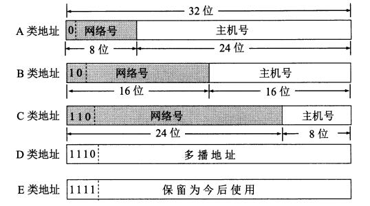

- [IP基本认识](#ip基本认识)
- [IP地址](#ip地址)
  - [点分四组表示法](#点分四组表示法)
  - [分类寻址](#分类寻址)
  - [子网寻址，无分类地址（CIDR）](#子网寻址无分类地址cidr)
  - [广播地址](#广播地址)
  - [IPv4地址不够怎么办](#ipv4地址不够怎么办)
  - [公有IP地址和私有IP地址](#公有ip地址和私有ip地址)
  - [IPv6地址](#ipv6地址)
- [IP报文](#ip报文)
- [路由控制](#路由控制)
  - [路由器组成](#路由器组成)
  - [分组转发流程](#分组转发流程)
  - [选路算法](#选路算法)
  - [路由选择协议](#路由选择协议)
  - [路由器和交换机的区别](#路由器和交换机的区别)
- [IP协议相关技术](#ip协议相关技术)
  - [ARP(地址解析协议)](#arp地址解析协议)
  - [DHCP(动态主机配置协议)](#dhcp动态主机配置协议)
  - [NAT(网络地址转换)](#nat网络地址转换)
  - [ICMP(互联网控制报文协议)](#icmp互联网控制报文协议)
  - [IGMP,因特网组管理协议](#igmp因特网组管理协议)

----------------------------------------------------------------------------------

# IP基本认识

- 实现主机与主机之间的通信，在复杂的网络环境中将数据报发送给最终目的主机
- 和链路层MAC的区别
  - MAC的作用实现「直连」的两个设备之间通信，而IP则负责在「没有直连」的两个网络之间进行通信传输
  - 源IP地址和目标IP地址在传输过程中是不会变化的，只有源MAC地址和目标MAC一直在变化。
- 特性
  - 不可靠，不保证网络包的交付、不保证网络包的按序交付、也不保证网络包中数据的完整性。
  - 提供一种无连接/不可靠、尽力而为的数据包传输服务 
- 作用
  - 寻址和路由
    - 在IP 数据包中会携带源 IP 地址和目的 IP 地址来标识该数据包的源主机和目的主机
    - IP 数据报在传输过程中，每个中间节点（IP 网关、路由器）只根据网络地址进行转发
    - 如果中间节点是路由器，则路由器会根据路由表选择合适的路径。IP 协议根据路由选择协议提供的路由信息对 IP 数据报进行转发，直至抵达目的主机。
  - 分段与重组
    - IP 数据包在传输过程中可能会经过不同的网络，在不同的网络中数据包的最大长度限制是不同的
    - IP 协议通过给每个 IP 数据包分配一个标识符以及分段与组装的相关信息，使得数据包在不同的网络中能够传输
    - 被分段后的 IP 数据报可以独立地在网络中进行转发，在到达目的主机后由目的主机完成重组工作，恢复出原来的 IP 数据包。

# IP地址

## 点分四组表示法

- IPv4地址长度为32位
- 点分四组表示法由四个用点分隔的十进制数组成，每8位为一组。每个数字是一个非负整数,范围为[0, 255]
- IP地址并不是根据主机台数来配置的，而是以网卡。像服务器、路由器等设备都是有2个以上的网卡，也就是它们会有2个以上的IP地址。

## 分类寻址

- 网络ID：标识网络，用于识别接口使用的IP地址在哪个网络中可被发现
- 主机ID ：标识单个主机，用于识别由网络部分给出的网络中的特定主机
- IPv4地址中的一些连续位称为网络号,其余位称为主机号。
- IP地址分类，
  - A类，第1字节为网络地址，其它3个字节为主机地址。它的第1个字节的第一位固定为0. `0.0.0.0 - 127.255.255.255`
  - B，第1字节和第2字节为网络地址，其它2个字节为主机地址。它的第1个字节的前两位固定为10.`128.0.0.0 - 191.255.255.255`
  - C，第1字节、第2字节和第3个字节为网络地址，第4个字节为主机地址。另外第1个字节的前三位固定为110。`192.0.0.0 - 223.255.255.255`
  - D，不分网络地址和主机地址，它的第1个字节的前四位固定为1110。`224.0.0.0 - 239.255.255.255`
    - 用于多播，于将包发送给特定组内的所有主机
  - E，不分网络地址和主机地址，它的第1个字节的前四位固定为11110。`240.0.0.0-255.255.255.255`
  - 地址块中的第一个和最后一个地址通常不使用
    - 主机号全为1：代表某个网络下的所有主机，用于广播
    - 主机号全为0：网络号，代表了整个网络本身
- 优点
  - 解析IP地址时，能很快得到网络地址和主机地址
- 缺点
  - 同一网络下没有地址层次
  - 会造成大量的浪费，例如一个有500台主机的网络，无法使用C类地址。但如果使用一个B类地址，6万多个主机地址只有500个被使用，造成IP地址的大量浪费

## 子网寻址，无分类地址（CIDR）

- 表示形式`a.b.c.d/x`，其中`/x`表示前x位属于网络号，x 的范围是 0 ~ 32
- 将基础地址中的主机部分进一步划分为一个子网号和一个主机号
- 会增加使用成本，因为子网字段和主机字段的定义需要由站点指定
- 子网掩码：由一台主机或路由器使用的分配位,确定一个IP地址的网络/子网部分的结束和主机部分的开始。
  - 子网掩码与对应的IP地址长度相同
  - 由一些1后跟一些0构成
  - 可以用点分十进制方法表示，亦可以只给出前缀长度
  - 将子网掩码和IP地址按位计算AND就可得到网络号
- 可变长度子网掩码(VLSM)
- 在同一站点的不同部分,可将不同长度的子网掩码应用于相同网络号。虽然这样增加了地址配置管理的复杂性,但也提高了子网结构的灵活性,这是由于不同子网可容纳不同数量的主机。

## 广播地址

- 子网广播地址通过将IPv4地址的网络/子网部分设置为适当值,以及主机部分的所有位设置为1而形成
- 定向广播，这种广播可作为一个单独的数据报通过Internet路由直至到达目标子网,再作为一组广播数据报发送给子网中所有主机。
  - 例如网络地址为192.168.0.0/24的主机向 192.168.1.255/24的目标地址发送 IP 包。
  - 收到这个包的路由器，将数据转发给 192.168.1.0/24，从而使得所有192.168.1.1~192.168.1.254 的主机都能收到这个包
- 本地网络广播(有限广播)，255.255.255.255，不需要路由器转发
  - 例如网络地址为 192.168.0.0/24 的情况下，广播地址是192.168.0.255 。因为这个广播地址的 IP 包会被路由器屏蔽，所以不会到达 192.168.0.0/24 以外的其他链路路上。

## IPv4地址不够怎么办

- DHCP
  - 动态主机配置协议。动态分配 IP 地址，只给接入网络的设备分配IP地址，因此同一个 MAC 地址的设备，每次接入互联网时，得到的IP地址不一定是相同的，该协议使得空闲的 IP 地址可以得到充分利用。
- CIDR无分类地址。
  - CIDR 消除了传统的 A 类、B 类、C 类地址以及划分子网的概念，因而更加有效的分配 IPv4 的地址空间，但无法从根本上解决地址耗尽问题。
- NAT网络地址转换协议。
  - 我们知道属于不同局域网的主机可以使用相同的 IP 地址，从而一定程度上缓解了 IP 资源枯竭的问题。然而主机在局域网中使用的 IP 地址是不能在公网中使用的，当局域网主机想要与公网进行通信时，NAT方法可以将该主机IP地址转换成全球IP地址。该协议能够有效解决IP地址不足的问题。
- IPv6
  - 作为接替 IPv4 的下一代互联网协议，其可以实现 2 的 128 次方个地址，而这个数量级，即使是给地球上每一颗沙子都分配一个IP地址，该协议能够从根本上解决 IPv4 地址不够用的问题。

## 公有IP地址和私有IP地址

- 私有IP地址
  - 通常是内部的IT人员管理
  - 可以重复
- 公有IP地址
  - 由ICANN组织管理理，中文叫「互联网名称与数字地址分配机构」。
  - 公有IP地址基本上要在整个互联网范围内保持唯一，不能重复
- NAT，网络地址转换

## IPv6地址

* 长度位128位，是IPv4地址的4倍
* 四个十六进制数组成一个块(字段),每个块之间由冒号分隔，最多共8个块。
  * 一个块中前导的零必须压缩。
  * 全零的块可以省略,并用符号::代替。但为了避免出现歧义,一个IPv6地址中符号::只能使用一次，且只能用于影响最大的地方(压缩最多的零),如果多个块中包含等长度的零,顺序靠前的块将被替换为::
  * a到f的十六进制数字应该用小写表示
* IPv4映射的IPv6地址
  * 在IPv6格式中嵌人IPv4地址可使用混合符号形式,紧接着IPv4部分的地址块的值为ffff,地址的其余部分使用点分四组格式。
* IPv4兼容的IPv6地址
  * 将IPv6地址的低32位采用点分四组表示法。
  * 这种地址最初用于IPv4和IPv6之间的过渡计划,但现在不再需要。
* 为了防止IPv6地址中的冒号分隔符可能与其他分隔符混淆，可用括号字符 [ 和 ] 包围IPv6地址

# IP报文

- 20字节的固定部分
- 版本 : 有 4（IPv4）和 6（IPv6）两个值；
- 协议 ：指出携带的数据应该上交给哪个协议进行处理，例如 ICMP、TCP、UDP 等。
- 首部长度 : 占 4 位，因此最大值为 15。值为 1 表示的是 1 个 32 位字的长度，也就是 4 字节。因为固定部分长度为 20 字节，因此该值最小为 5。如果可选字段的长度不是 4 字节的整数倍，就用尾部的填充部分来填充。
- 总长度 : 包括首部长度和数据部分长度。
- 区分服务 : 用来获得更好的服务，一般情况下不使用。
- 生存时间 ：TTL，它的存在是为了防止无法交付的数据报在互联网中不断兜圈子。以路由器跳数为单位，每经过一个路由器，它的值就减1，当此值为0则数据报被丢弃，同时发送ICMP报文通知源主机
- 首部检验和 ：因为数据报每经过一个路由器，都要重新计算检验和，因此检验和不包含数据部分可以减少计算的工作量。
- 标识 : 在数据报长度过长从而发生分片的情况下，相同数据报的不同分片具有相同的标识符。
- 片偏移 : 和标识符一起，用于发生分片的情况。片偏移的单位为 8 字节。

# 路由控制

## 路由器组成

- **输入端口**
  - 查找/转发模块：对于路由器的转发功能是至关重要的。许多路由器中，都是在这确定一个到达的分组经交换结构转发到哪个输出端口。虽然转发表是由选路处理器计算的，但通常一份转发表的影子拷贝会被存放在每个输入端口，而且会被更新。因此，就可以在每个输入端口本地做出转发决策，而无需调用中央选路处理器，从而可以避免在路由器中的某个单点产生转发处理的瓶颈
- **交换结构**
  - 经内存交换：分组到达输入端口时，端口会通过中断向选路处理器发出信号，于是分组被拷贝到处理器内存中。选路处理器则从分组首部中取出目的地址，在转发表中找出适当的输出端口，并将分组拷贝到输出端口的缓存中
  - 经一根总线交换：经一根共享总线将分组直接传送到输出端口，不需要选路处理器的干预。因为总线是共享的，故一次只能有一个分组通过总线传送
  - 经一个互连网络交换：到达某个输入端口的分组沿着连到输入端口的水平总线穿行，直至该水平总线与连到所希望的输出端口的垂直总线的交叉点
- **输出端口**
- **选路处理器**：维护路由选择协议和路由表，执行路由器中的网络管理功能

## 分组转发流程

- 从IP数据包中提取出目的主机的IP地址，并得到目的网络地址；
- 判断目的网络地址是否与本路由器直接相连，如果是，则不需要经过其它路由器直接交付，否则执行 ③；
- 检查路由表中是否有目的IP地址的特定主机路由。如果有，则按照路由表传送到下一跳路由器中，否则执行 ④；
- 检查路由表中是否有到达目的网络地址的特定主机路由，若找到匹配路由，则按照路由表转发到下一跳路由器中，否则执行步骤 ⑤；
- 若路由表中设置有默认路由，则按照默认路由转发到默认路由器中，否则执行步骤 ⑥；
- 无法找到合适路由，向源主机报错。

## 选路算法

- **全局选路算法(LS算法)**
  - 全局选路算法用完整的、全局性的网络信息来计算从源到目的地之间的最低费用路径。
  - 由于具有全局状态信息，所以这种算法又常被称为链路状态算法
- **距离向量算法**分布式选路算法
  - 以迭代的、分布式的方式计算出最低费用路径。
  - 和全局选路算法的区别在于，没有节点拥有关于所有网络链路费用的完整信息，每个节点仅有与其直接相连链路的费用信息
  - 对地址为 X 的相邻路由器发来的 RIP 报文，先修改报文中的所有项目，把下一跳字段中的地址改为 X，并把所有的距离字段加 1；
  - 对修改后的 RIP 报文中的每一个项目，进行以下步骤：
    - 若原来的路由表中没有目的网络 N，则把该项目添加到路由表中；
    - 否则：若下一跳路由器地址是 X，则把收到的项目替换原来路由表中的项目；否则：若收到的项目中的距离 d小于路由表中的距离，则进行更新（例如原始路由表项为 Net2, 5, P，新表项为 Net2, 4, X，则更新）；否则什么也不做。
    - 若 3 分钟还没有收到相邻路由器的更新路由表，则把该相邻路由器标为不可达，即把距离置为 16。

## 路由选择协议

- 自治系统(AS)
  - 一组处于相同的管理与技术控制下的路由器集合
  - 随着路由器数目变大，选路信息的计算、存储及通信的开销逐渐高得惊人，数亿台主机中存储选路信息需要巨大容量的内存。在公共因特网上所有路由器上广播LS更新的开销将导致没有剩余带宽供发送数据分组使用。距离向量算法在如此大的路由器中的迭代将肯定永远不会收敛。可以将路由器组织成自治系统(AS)来解决
- AS之间：**边界网关协议(BGP/BGP4)**
  - 路由器对使用179端口的半永久TCP连接交换选路信息
  - 每个 AS 都必须配置 BGP 发言人，通过在两个相邻 BGP 发言人之间建立 TCP 连接来交换路由信息
  - BGP中，目的地是CIDR化的前缀，表示一个子网或子网集合（假设有多个子网与一个AS相连，AS会聚合这些前缀，来向相邻的AS通告聚合后的单一前缀，如果到达相同前缀有多个路由，BGP会使用一些规则消除直到留下一条路由）
- AS内部
  - **开放最短路径优先(OSPF)**
    - 使用LS选路算法
      - 向本自治系统中的所有路由器发送信息，这种方法是洪泛法。
      - 发送的信息就是与相邻路由器的链路状态，链路状态包括与哪些路由器相连以及链路的度量，度量用费用、距离、时延、带宽等来表示。
      - 只有当链路状态发生变化时，路由器才会发送信息。
      - 所有路由器都具有全网的拓扑结构图，并且是一致的。相比于 RIP，OSPF 的更新过程收敛的很快。
    - 至少每隔30分钟广播一次链路状态(即使状态未发生改变)
  - **选路信息协议(RIP)**
    - 采用距离向量算法
      - 距离是指跳数，直接相连的路由器跳数为 1。跳数最多为 15，超过 15 表示不可达。
      - 按固定的时间间隔仅和相邻路由器交换自己的路由表，经过若干次交换之后，所有路由器最终会知道到达本自治系统中任何一个网络的最短距离和下一跳路由器地址。
    - 大约每30秒通过RIP响应报文(也称为RIP通告)交换距离向量信息
    - 实现简单，开销小。但是 RIP 能使用的最大距离为 15，限制了网络的规模。并且当网络出现故障时，要经过比较长的时间才能将此消息传送到所有路由器。

## 路由器和交换机的区别

- 交换机
  - 交换机用于局域网，利用主机的物理地址（MAC 地址）确定数据转发的目的地址，它工作于数据链路层。
  - 使用硬件工作，快，只能处理简单的路由转发
- 路由器
  - 路由器通过数据包中的目的 IP 地址识别不同的网络从而确定数据转发的目的地址，网络号是唯一的。
  - 路由器根据路由选择协议和路由表信息从而确定数据的转发路径，直到到达目的网络，它工作于网络层。
  - 用软件实现，较慢，能实现复杂网络路由。

# IP协议相关技术

- DNS 域名解析
- ARP 与 RARP 协议
- DHCP 动态获取 IP 地址
- NAT 网络地址转换
- ICMP 互联⽹控制报⽂协议
- IGMP 因特⽹组管理协议

## ARP(地址解析协议)

- ARP只为同一子网上的节点解析IP地址，DNS为因特网中任何地方的主机解析主机名
- **提供将IP地址转换为链路层地址的功能**
- 解析过程
  - 建立ARP列表
    - 每个主机都会在自己的 ARP 缓冲区中建立一个 ARP缓存表，以表示 IP 地址和 MAC 地址之间的对应关系
    - 每个表项还包含TTL字段，表示表项过期时间（ARP表是自动创建的，如果某节点与子网断开连接，它的表项最终会从留在子网中的节点的表中删除。通常一个表项的过期时间是20分钟）
  - 当源主机要发送数据时，首先检查 ARP缓存表中是否有 IP 地址对应的目的主机 MAC 地址，如果存在，则可以直接发送数据
  - 否则要重新获取MAC地址，进行ARP查询
    - 借助ARP请求与ARP响应两种类型的包确定 MAC 地址
    - 主机广播发送 ARP 请求，该数据包包括的内容有源主机的 IP 地址和 MAC 地址，以及目的主机的 IP 地址。
    - 当本网络中的所有主机收到该 ARP 数据包时，首先检查数据包中的 目的 主机IP 地址是否是自己的 IP 地址，如果不是，则忽略该数据包，如果是，则首先从数据包中取出源主机的 IP 和 MAC 地址写入到 ARP 列表中，如果已经存在，则覆盖，然后将自己的 MAC 地址写入 ARP 响应包中，告诉源主机自己是它想要找的 MAC 地址。
    - 源主机收到 ARP 响应包后。将目的主机的 IP 和 MAC 地址写入 ARP 列表，并利用此信息发送数据
  - 如果源主机一直没有收到 ARP 响应数据包，表示 ARP 查询失败。
- **发送数据报到子网以外**？
  - 假设主机1要向主机2发送数据报，应该使用什么MAC地址？如果使用49-BD-D2-C7-56-2A作为目的MAC地址，由于子网内任何一个适配器的MAC地址都不匹配，所以这个数据报将会死亡。正确的步骤如下：
    - 主机1通过ARP获取路由器接口111.111.111.110的MAC地址，将数据报封装成帧，转发
    - 路由器的接口111.111.111.110收到帧，由于MAC地址匹配，适配器获取帧中的数据报上传给网络层
    - 路由器通过查找转发表将数据报通过交换结构转发到输出接口222.222.222.220
    - 输出接口222.222.222.220通过ARP获取子网中主机2的MAC地址
    - 获得主机2的MAC地址后，将数据报传递给适配器，封装成帧，最终发送到主机2 
- RARP
  - 已知 MAC 地址求 IP 地址
  - 将打印机服务器器等⼩小型嵌⼊入式设备接⼊入到网络时就经常会用得到
  - 步骤
    - 需要架设一台RARP服务器，在这个服务器上注册设备的MAC地址及其IP地址。然后再将这个设备接入到网络，接着：
    - 该设备会发送一条「我的MAC地址是XXXX，请告诉我，我的IP地址应该是什么」的请求信息。
    - RARP 服务器接到这个消息后返回「MAC地址为 XXXX 的设备，IP地址为 XXXX」的信息给这个设备。
    - 最后，设备就根据从 RARP 服务器所收到的应答信息设置自己的 IP 地址。
- ARP攻击
  - 在 ARP 的解析过程中，局域网上的任何一台主机如果接收到一个 ARP 应答报文，并不会去检测这个报文的真实性，而是直接记入自己的 ARP 缓存表中。并且这个 ARP 表是可以被更改的，当表中的某一列长时间不适使用，就会被删除。
  - ARP 攻击就是利用了这一点，攻击者疯狂发送 ARP 报文，其源 MAC 地址为攻击者的 MAC 地址，而源 IP 地址为被攻击者的 IP 地址。通过不断发送这些伪造的 ARP 报文，让网络内部的所有主机和网关的 ARP 表中被攻击者的 IP 地址所对应的 MAC 地址为攻击者的 MAC 地址。这样所有发送给被攻击者的信息都会发送到攻击者的主机上，从而产生 ARP 欺骗。通常可以把 ARP 欺骗分为以下几种
    - 洪泛攻击
      - 攻击者恶意向局域网中的网关、路由器和交换机等发送大量 ARP 报文，设备的 CPU 忙于处理 ARP 协议，而导致难以响应正常的服务请求。其表现通常为：网络中断或者网速很慢。
    - 欺骗主机
      - 这种攻击方式也叫仿冒网关攻击。攻击者通过 ARP 欺骗使得网络内部被攻击主机发送给网关的信息实际上都发送给了攻击者，主机更新的 ARP 表中对应的 MAC 地址为攻击者的 MAC。当用户主机向网关发送重要信息使，该攻击方式使得用户的数据存在被窃取的风险。
    - 欺骗网关
      - 该攻击方式和欺骗主机的攻击方式类似，不过这种攻击的欺骗对象是局域网的网关，当局域网中的主机向网关发送数据时，网关会把数据发送给攻击者，这样攻击者就会源源不断地获得局域网中用户的信息。该攻击方式同样会造成用户数据外泄。
    - 中间人攻击
      - 攻击者同时欺骗网关和主机，局域网的网关和主机发送的数据最后都会到达攻击者这边。这样，网关和用户的数据就会泄露。
    - IP 地址冲突
      - 攻击者对局域网中的主机进行扫描，然后根据物理主机的 MAC 地址进行攻击，导致局域网内的主机产生 IP 冲突，使得用户的网络无法正常使用。

## DHCP(动态主机配置协议)

- DHCP客户端进程监听的是68端口号，DHCP服务端进程监听的是67端口号。
- DHCP可以提供以下服务：
  - 为主机分配IP地址
  - 获取子网掩码
  - 获取第一跳路由器地址（常称为默认网关）
  - 提供本地DNS服务器的地址（记录在/etc/resolv.conf文件中）
- **DHCP协议的4个步骤：**
  - DHCP发现
    - 由于客户端没有 IP 地址，也不知道 DHCP 服务器器的地址，所以使用的是UDP广播通信
    - 广播目的地址是255.255.255.255（端口 67） 并且使用 0.0.0.0（端口 68） 作为源 IP 地址。
    - DHCP 客户端将该 IP数据报传递给链路路层，链路路层然后将帧⼴广播到所有的网络中设备。
  - DHCP提供
    - 子网中收到DHCP发现报文的DHCP服务器使用**DHCP提供报文**作出响应
    - 提供IP地址、网络掩码、IP地址租用期(通常设置为几个小时或几天)，DNS服务器，默认网关
  - DHCP请求
    - 客户端从多个服务器的响应中选择一个，并用一个**DHCP请求报文**对选中的服务器进行响应，回显配置参数（这一步目的地址使用广播地址是因为在DHCP服务器提供时，服务器为客户预分配了IP地址，因此，客户有责任通知不采用的服务器，好让它们释放预分配的地址）
  - DHCP ACK
    - 服务器用**DHCP ACK报文**对DHCP请求报文进行响应，证实所要求的参数
- 租约的DHCP IP地址过期
  - 客户端会向DHCP服务器发送 DHCP 请求报文：
  - 服务器如果同意继续租用，则用 DHCP ACK 报文进行应答，客户端就会延长租期。
  - 服务器如果不同意继续租用，则用 DHCP NACK 报文，客户端就要停止使用租约的 IP 地址。
- DHCP中继代理
  - 每个子网拥有一台DHCP服务器，如果某个子网没有DHCP服务器，则需要一个知道用于该网络的一台DHCP服务器地址的DHCP中继代理（通常是一台路由器）
- DHCP有不足之处
  - 每当一个节点连到一个新子网时，都要从DHCP得到一个新的IP地址，这样当一个移动节点在子网直接移动时，就不能维持与远程应用之间的连接。移动IP是一种对IP基础设施的扩展，允许移动节点在子网之间移动时能使用其单一永久的地址

## NAT(网络地址转换)

- 把内部私有网络地址翻译成公有网络 IP 地址的技术。
- 该技术不仅能解决 IP 地址不足的问题，而且还能隐藏和保护网络内部主机，从而避免来自外部网络的攻击。
- NAT 的实现方式主要有三种：
  - 静态转换
    - 内部私有 IP 地址和公有 IP 地址是一对一的关系，并且不会发生改变。
    - 通过静态转换，可以实现外部网络对内部网络特定设备的访问，这种方式原理简单，但当某一共有 IP 地址被占用时，跟这个 IP 绑定的内部主机将无法访问 Internet。
  - 动态转换
    - 采用动态转换的方式时，私有 IP 地址每次转化成的公有 IP 地址是不唯一的。当私有 IP 地址被授权访问 Internet 时会被随机转换成一个合法的公有 IP 地址。当 ISP 通过的合法 IP 地址数量略少于网络内部计算机数量时，可以采用这种方式。
  - 端口多路复用
    - 该方式将外出数据包的源端口进行端口转换，通过端口多路复用的方式，实现内部网络所有主机共享一个合法的外部 IP 地址进行 Internet 访问，从而最大限度地节约 IP 地址资源。同时，该方案可以隐藏内部网络中的主机，从而有效避免来自 Internet 的攻击。

## ICMP(互联网控制报文协议)

- 用于主机和路由器彼此交互网络层信息。最典型的用途是差错报告，但其用途不仅限于此(如源抑制，用于拥塞控制)
- 该协议并不传输数据，只传输控制信息来辅助网络层通信。
- 其主要的功能是验证网络是否畅通（确认接收方是否成功接收到 IP 数据包）以及辅助 IP 协议实现可靠传输（若发生 IP 丢包，ICMP 会通知发送方 IP 数据包被丢弃的原因，之后发送方会进行相应的处理）
- **Ping**
  - Ping（Packet Internet Groper），即因特网包探测器，主要用于测试网络连接量。
  - 本地主机通过向目的主机发送 ICMP Echo 请求报文，目的主机收到之后会发送 Echo 响应报文，Ping 会根据时间和成功响应的次数估算出数据包往返时间以及丢包率从而推断网络是否通常、运行是否正常等。
- **TraceRoute**
  - 用来跟踪一个分组从源点耗费最少 TTL 到达目的地的路径。
  - TraceRoute 通过逐渐增大 TTL 值并重复发送数据报来实现其功能
    - 发送的 IP 数据报封装的是无法交付的 UDP 用户数据报，并由目的主机发送终点不可达差错报告报文
    - 首先，TraceRoute 会发送一个 TTL 为 1 的 IP 数据报到目的地，当路径上的第一个路由器收到这个数据报时，它将 TTL 的值减 1，此时 TTL = 0，所以路由器会将这个数据报丢掉，并返回一个**时间超过差错报告报文**
    - 之后源主机会接着发送一个 TTL 为 2 的数据报，并重复此过程，直到数据报能够刚好到达目的主机。此时 TTL = 0，因此目的主机要向源主机发送 ICMP**终点不可达差错报告报文**，之后源主机便知道了到达目的主机所经过的路由器 IP 地址以及到达每个路由器的往返时间

## IGMP,因特网组管理协议