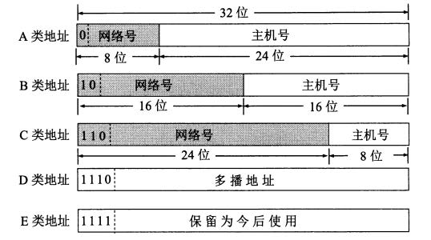

# 网络层

## IPv4地址

### 点分四组表示法

* IPv4地址长度为32位
* 点分四组表示法由四个用点分隔的十进制数组成。每个数字是一个非负整数,范围为[0, 255]

#### 分类寻址

* 网络ID：标识网络，用于识别接口使用的IP地址在哪个网络中可被发现
* 主机ID ：标识单个主机，用于识别由网络部分给出的网络中的特定主机
* IPv4地址中的一些连续位称为网络号,其余位称为主机号。
* IP地址分类，
  * A类，第1字节为网络地址，其它3个字节为主机地址。它的第1个字节的第一位固定为0. `0.0.0.0 - 127.255.255.255`
  * B，第1字节和第2字节为网络地址，其它2个字节为主机地址。它的第1个字节的前两位固定为10.`128.0.0.0 - 191.255.255.255`
  * C，第1字节、第2字节和第3个字节为网络地址，第4个字节为主机地址。另外第1个字节的前三位固定为110。`192.0.0.0 - 223.255.255.255`
  * D，不分网络地址和主机地址，它的第1个字节的前四位固定为1110。`224.0.0.0 - 239.255.255.255`
  * E，不分网络地址和主机地址，它的第1个字节的前四位固定为11110。`240.0.0.0-255.255.255.255`
  * 地址块中的第一个和最后一个地址通常不使用
* 缺点：会造成大量的浪费，例如一个有500台主机的网络，无法使用C类地址。但如果使用一个B类地址，6万多个主机地址只有500个被使用，造成IP地址的大量浪费

#### 子网寻址

* 将基础地址中的主机部分进一步划分为一个子网号和一个主机号
* 会增加使用成本，因为子网字段和主机字段的定义需要由站点指定
* 子网掩码：由一台主机或路由器使用的分配位,确定一个IP地址的网络/子网部分的结束和主机部分的开始。
  * 子网掩码与对应的IP地址长度相同
  * 由一些1后跟一些0构成
  * 可以用点分十进制方法表示，亦可以只给出前缀长度
  * 子网掩码中的一位设为1表示一个IP地址的对应位与一个地址的网络/子网部分的对应
位相结合,并将结果作为转发数据报的基础
  * 子网掩码中的一位设为0,表示一个IP地址的对应位作为主机ID的一部分
* 可变长度子网掩码(VLSM)
  * 在同一站点的不同部分,可将不同长度的子网掩码应用于相同网络号。虽然这样增加了地址配置管理的复杂性,但也提高了子网结构的灵活性,这是由于不同子网可容纳不同数量的主机。

#### 广播地址

* 子网广播地址通过将IPv4地址的网络/子网部分设置为适当值,以及主机部分的所有位设置为1而形成
* 定向广播，这种广播可作为一个单独的数据报通过Intemet路由直至到达目标子网,再作为一组广播数据报发送给子网中所有主机。
* 本地网络广播(有限广播)，255.255.255.255，不需要路由器转发

## IPv6地址

* 长度位128位，是IPv4地址的4倍
* 四个十六进制数组成一个块(字段),每个块之间由冒号分隔，最多共8个块。
  * 一个块中前导的零必须压缩。
  * 全零的块可以省略,并用符号::代替。但为了避免出现歧义,一个IPv6地址中符号::只能使用一次，且只能用于影响最大的地方(压缩最多的零),如果多个块中包含等长度的零,顺序靠前的块将被替换为::
  * a到f的十六进制数字应该用小写表示
* IPv4映射的IPv6地址
  * 在IPv6格式中嵌人IPv4地址可使用混合符号形式,紧接着IPv4部分的地址块的值为ffff,地址的其余部分使用点分四组格式。
* IPv4兼容的IPv6地址
  * 将IPv6地址的低32位采用点分四组表示法。
  * 这种地址最初用于IPv4和IPv6之间的过渡计划,但现在不再需要。
* 为了防止IPv6地址中的冒号分隔符可能与其他分隔符混淆，可用括号字符 [ 和 ] 包围IPv6地址