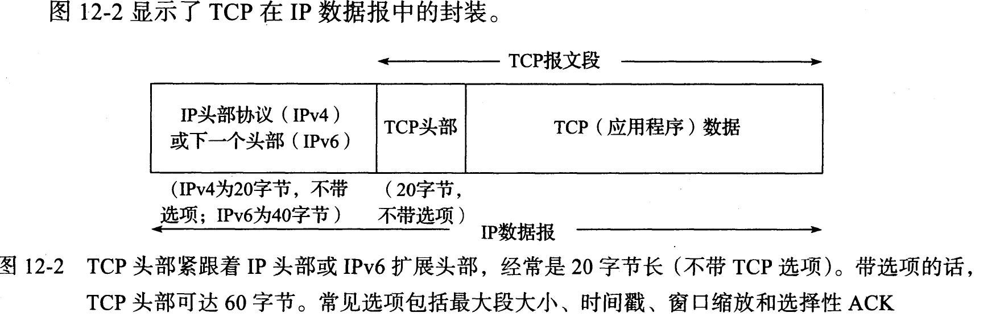
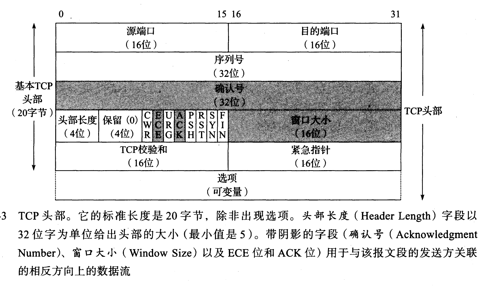
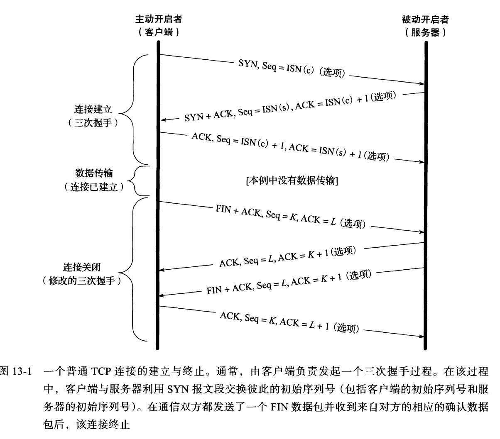

- [0.概述](#0概述)
  - [端口号](#端口号)
  - [TCP特征简介](#tcp特征简介)
  - [TCP头部和封装](#tcp头部和封装)
    - [push报文](#push报文)
    - [rst报文](#rst报文)
  - [TCP四元组](#tcp四元组)
  - [TCP最大连接数限制](#tcp最大连接数限制)
  - [TCP数据长度的计算](#tcp数据长度的计算)
  - [TCP分片](#tcp分片)
  - [TCP中的七种计时器](#tcp中的七种计时器)
- [1.连接管理](#1连接管理)
  - [连接的建立与终止](#连接的建立与终止)
    - [序列号的初始化](#序列号的初始化)
    - [是否可以携带数据](#是否可以携带数据)
    - [为什么是三次握手？](#为什么是三次握手)
    - [为什么是四次挥手？](#为什么是四次挥手)
  - [TIME-WAIT状态的意义](#time-wait状态的意义)
  - [过多TIME_WAIT状态](#过多time_wait状态)
  - [有很多 CLOSE-WAIT 怎么解决](#有很多-close-wait-怎么解决)
  - [如果已经建立了连接，但是客户端突然出现故障了怎么办](#如果已经建立了连接但是客户端突然出现故障了怎么办)
  - [DDos](#ddos)
  - [SYN攻击](#syn攻击)
- [2. 可靠性获得](#2-可靠性获得)
  - [超时重传](#超时重传)
  - [快速重传](#快速重传)
  - [滑动窗口和流量控制](#滑动窗口和流量控制)
    - [窗口关闭](#窗口关闭)
    - [糊涂窗口综合症](#糊涂窗口综合症)
  - [拥塞控制](#拥塞控制)
    - [流量控制vs拥塞控制](#流量控制vs拥塞控制)
    - [没有拥塞控制的场景](#没有拥塞控制的场景)
    - [拥塞窗口，cwnd](#拥塞窗口cwnd)
    - [采用的四种算法](#采用的四种算法)
  - [为什么会发生TCP粘包和拆包?](#为什么会发生tcp粘包和拆包)
  - [Nagle和延迟ACK](#nagle和延迟ack)
- [3.UDP](#3udp)
  - [UDP报文段结构](#udp报文段结构)
  - [TCP和UDP区别](#tcp和udp区别)
  - [出于下列原因可能使用UDP](#出于下列原因可能使用udp)
  - [tcp和udp可以公用端口](#tcp和udp可以公用端口)
- [4.套接字编程](#4套接字编程)
  - [套接字简介](#套接字简介)
  - [TCP涉及的套接字编程](#tcp涉及的套接字编程)
  - [监听socket和已完成连接socket](#监听socket和已完成连接socket)

--------------------
# 0.概述

## 端口号

- 通常在一台主机上能够运行许多网络应用程序。IP地址可以标识一台主机，端口号则是用来标识这台主机上的特定进程
- 端口号是一个16bit的数字，大小在0~65535之间，0~1023范围的端口号称为周知端口号，保留给周知的应用层协议
  - HTTP是80，FTP是20（数据端口）、21（控制端口），HTTPS是443

## TCP特征简介
- 一个工作在传输层的面向连接的、可靠的、基于字节流的通信协议
- TCP提供一种面向连接、可靠的的字节流服务
  - 面向连接：使用TCP的两个应用程序必须在它们可交换数据之前，通过相互联系来建立一个TCP连接。每个TCP连接由一对套接字唯一标识，必须一对一
  - 字节流：没有消息边界。对字节流的解读取决于连接中的每个端点
  - 可靠：能确保接收端接收的网络包无损坏、无间隔、⾮冗余和按序的

## TCP头部和封装

  


- 20字节的固定大小
- 源端口号（16位),目的端口号（16位)。和IP头部中的源和目的IP地址一起唯一地标识了每个连接
- 序列号(32位)：TCP的序号是数据流中的字节数，不是分组的序号。表示该报文段数据字段首字节的序号
- 确认号(32位)：TCP使用累积确认，确认号是第一个未收到的字节序号，表示希望接收到的下一个字节
- 头部长度（4位）：以32位字为单位给出头部的大小(最小值为5，也就是20字节)，最大为15，也就是60字节
- 标志字段 
  - CWR: 拥塞窗口减，发送方降低发送速率
  - ECE: ECN回显，发送方接收到了一个更早的拥塞报告
  - URG：报文段中存在着(被发送方的上层实体置位)“紧急”的数据
  - **ACK**: 指示确认字段中的值是有效的
  - PSH：指示接收方应立即将数据交给上层(实际没被可靠的实现或利用）
  - **RST**：重置连接
  - **SYN**：初始化一个连接的同步序列号
  - **FIN**: 用来释放一个连接，当 FIN=1 时，表示此报文段的发送方的数据已发送完毕，并要求释放连接。
- 接收窗口大小（16位）：用于流量控制（表示接收方还有多少可用的缓存空间）
- 校验和（16位）
- 紧急指针（16位）：只有在URG字段被设置时才有效。
- 常见选项字段，最多40字节
  - MSS,最大段大小。指定该选项的发送者在相反方向上希望接收到的报文段的最大值
  - SACK
  - 时间戳
  - 窗口缩放
- **不带数据部分的TCP报文段**
  - 连接建立和终止时
  - 纯ACK
  - 窗口更新

### push报文

- 通告接收方立即将收到的报文连同TCP接收缓存里的数据递交应用进程处理
- 发送端觉得传输的数据应用层可以进行处理了的时候发送
- 传输层及以下的数据往往是由系统所带的协议栈进行处理的，客户端在收到一个个报文之后，经由协议栈解封装之后会立马把数据交给应用层去处理吗？如果说在收到报文之后立马就交给上层，这时候应用层由于数据不全，可能也不会进行处理。而且每来一个报文就交一次，效率很低。因此传输层一般会是隔几个报文，统一上交数据


### rst报文

- 用于TCP的异常终止
- 客户端尝试与服务器未对外提供服务的端口建立TCP连接，服务器将会直接向客户端发送reset报文。
- 客户端和服务器的某一方在交互的过程中发生异常（如程序崩溃等），该方系统将向对端发送TCP reset报文，告之对方释放相关的TCP连接
- 接收端收到TCP报文，但是发现该TCP的报文，并不在其已建立的TCP连接列表内，则其直接向对端发送reset报文
- 在交互的双方中的某一方长期未收到来自对方的确认报文，则其在超出一定的重传次数或时间后，会主动向对端发送reset报文释放该TCP连接
- 主动利用reset报文快速释放已经完成数据交互的TCP连接，以提高业务交互的效率，

## TCP四元组

- 源端口，源地址。目的端口，目的地址
- 源地址和目的地址的字段（32位）是在IP头部中，作用是通过IP协议发送报文给对方主机。
- 源端口和目的端口的字段（16位）是在TCP头部中，作用是告诉TCP协议应该把报文发给哪个进程。

## TCP最大连接数限制
- 客户端最大TCP连接数
  - 客户端在每次发起 TCP 连接请求时，如果自己并不指定端口的话，系统会随机选择一个本地端口（local port),该端口是独占的，不能和其他 TCP 连接共
  - TCP端口是16位的，因此本地端口个数最大只有65536，除了端口0不能使用外，其他端口在空闲时都可以正常使用，这样可用端口最多有65535个。
- 服务器最大 TCP 连接数
  - 服务器通常固定在某个本地端口上监听，等待客户端的连接请求。不考虑地址重用（Unix 的 SO_REUSEADDR 选项）的情况下，即使 server 端有多个 IP，本地监听端口也是独占的
  - 因此服务器端 TCP 连接 4 元组中只有客户端的 IP 地址和端口号是可变的，因此最大 TCP 连接为客户端 IP 数 × 客户端 port 数，对 IPV4，在不考虑 IP 地址分类的情况下，最大 TCP 连接数约为 2 的 32 次方（IP 数）× 2 的 16 次方（port 数），也就是 server 端单机最大 TCP 连接数约为 2 的 48 次方
  - 然而上面给出的是只是理论上的单机最大连接数，在实际环境中，受到明文规定（一些 IP 地址和端口具有特殊含义，没有对外开放）、机器资源、操作系统等的限制，特别是 sever 端，其最大并发 TCP 连接数远不能达到理论上限。对 server 端，通过增加内存、修改最大文件描述符个数等参数，单机最大并发 TCP 连接数超过 10 万 是没问题的。

## TCP数据长度的计算
- IP总长度-IP首部长度-TCP首部长度
  - IP总长度和IP首部长度，在IP首部格式是已知的。
  - TCP首部长度，则是在TCP首部格式已知

## TCP分片

- 两个长度限制
  - **MSS(最大报文段长度)**：运输层报文段中“应用层数据”的最大大小，受限于MTU。在TCP连接建立过程中，通过SYN报文段中的MSS选项（16位）通告MSS，从而试图避免分片，MSS经常设置成MTU减去IP和TCP首部的固定长度。在以太网中使用IPv4的MSS值为1460，使用IPv6的MSS值为1440
  - **MTU(最大传输单元)**：即最大链路层帧长，链路层所能传输的最大帧大小
- 数据会被以MSS的长度为单位进行拆分，拆分出来的每一块数据都会被放进单独的网络包中。也就是在每个被拆分的数据加上TCP头信息，然后交给IP模块来发送数据。
- 目标主机收到后，也同样在传输层组装 TCP 数据包，如果中途丢失了一个分片，只需要传输丢失的这个分片。
- 如果在IP层进行分片，目标主机收到后，在IP层组装完数据，接着再传给传输层，但是如果中途丢了一个分片，则就需要重传所有的数据包，这样传输效率非常差，所以通常 UDP 的报文应该小于 MTU。

## TCP中的七种计时器

- 建立连接定时器
  - 该定时器是在建立 TCP 连接的时候使用的，在 TCP 三次握手的过程中，发送方发送 SYN 时，会启动一个定时器（默认为 3 秒），若 SYN 包丢失了，那么 3 秒以后会重新发送 SYN 包，直到达到重传次数。
- 重传定时器
  - 主要用于 TCP 超时重传机制中，当TCP 发送报文段时，就会创建特定报文的重传计时器，并可能出现两种情况：
    - 若在计时器截止之前发送方收到了接收方的 ACK 报文，则撤销该计时器；
    - 若计时器截止时间内并没有收到接收方的 ACK 报文，则发送方重传报文，并将计时器复位。
- 坚持计时器
  - TCP 通过让接受方指明希望从发送方接收的数据字节数（窗口大小）来进行流量控制
  - 当接收端的接收窗口满时，接收端会告诉发送端此时窗口已满，请停止发送数据。
  - 此时发送端和接收端的窗口大小均为0，直到窗口变为非0时，接收端将发送一个确认ACK告诉发送端可以再次发送数据，但是该报文有可能在传输时丢失。
  - 若该 ACK 报文丢失，则双方可能会一直等待下去，为了避免这种死锁情况的发生，发送方使用一个坚持定时器来周期性地向接收方发送探测报文段，以查看接收方窗口是否变大。
- 延迟应答计时器
  - 延迟应答也被称为捎带 ACK，这个定时器是在延迟应答的时候使用的
  - 为了提高网络传输的效率，当服务器接收到客户端的数据后，不是立即回 ACK 给客户端，而是等一段时间，这样如果服务端有数据需要发送给客户端的话，就可以把数据和 ACK 一起发送给客户端了。
- 保活定时器
  - 该定时器是在建立 TCP 连接时指定 SO_KEEPLIVE 时才会生效，当发送方和接收方长时间没有进行数据交互时，该定时器可以用于确定对端是否还活着。
- FIN_WAIT_2 定时器
  - 当主动请求关闭的一方发送 FIN 报文给接收端并且收到其对 FIN 的确认 ACK后进入 FIN_WAIT_2状态。如果这个时候因为网络突然断掉、被动关闭的一端宕机等原因，导致请求方没有收到接收方发来的 FIN，主动关闭的一方会一直等待。该定时器的作用就是为了避免这种情况的发生。当该定时器超时的时候，请求关闭方将不再等待，直接释放连接。
- TIME_WAIT 定时器
  - 我们知道在 TCP 四次挥手中，发送方在最后一次挥手之后会进入 TIME_WAIT 状态，不直接进入 CLOSE 状态的主要原因是被动关闭方万一在超时时间内没有收到最后一个 ACK，则会重发最后的 FIN，2 MSL（报文段最大生存时间）等待时间保证了重发的 FIN 会被主动关闭的一段收到且重新发送最后一个 ACK 。还有一个原因是在这 2 MSL 的时间段内任何迟到的报文段会被接收方丢弃，从而防止老的 TCP 连接的包在新的 TCP 连接里面出现。

# 1.连接管理

- 一个TCP连接由一对套接字(IP地址和端口的组合)构成
  
## 连接的建立与终止



- 传统情况下，发送连接和发起关闭的都是Client
- 一开始，客户端和服务端都处于CLOSED状态。先是服务端主动监听某个端⼝口，处于LISTEN状态
- 建立连接的三次握手
  1. Client将标志位SYN置为1，随机产生一个值seq=J，并将该数据包发送给Server，Client进入SYN_SENT状态，等待Server确认。 
  2. Server收到数据包后由标志位SYN=1知道Client请求建立连接，Server将标志位SYN和ACK都置为1，ack=J+1，随机产生一个值seq=K，并将该数据包发送给Client以确认连接请求，Server进入SYN_RCVD状态,为该TCP连接分配TCP缓存和变量。 
  3. Client收到确认后，检查ack是否为J+1，ACK是否为1，如果正确则将标志位ACK置为1，ack=K+1，为该连接分配缓存和变量,并将该数据包发送给Server，Server检查ack是否为K+1，ACK是否为1，如果正确则连接建立成功，Client和Server进入ESTABLISHED状态。
- 关闭连接的四次挥手
  1. Client将标志位FIN置位，Seq=K,同时包含ACK用于确认对方最近一次发来的数据，Client进入FIN_WAIT_1状态，此时客户端依然可以接收服务器发送来的数据。 
  2. Server接收到FIN后，发送一个ACK=K+1给客户端，表明已经成功接收到了FIN。同时Server进入CLOSE_WAIT状态。客户端收到后进入FIN_WAIT_2状态。 
  3. 当Server没有数据要发送时，发起自己的关闭操作。服务器发送一个FIN报文，此时服务器进入LAST_ACK状态，等待客户端的确认 
  4. 客户端收到服务器的FIN报文后，给服务器发送一个ACK报文，确认序列号为收到的序号+1。此时客户端进入TIME_WAIT状态，等待2MSL（MSL：报文段最大生存时间），然后关闭连接。 

### 序列号的初始化

- 连接建立时的seq是随机值，不是硬编码
- 


### 是否可以携带数据

- 第三次握手是可以携带数据的，前两次握手是不可以携带数据的

### 为什么是三次握手？

- 确认自己和对方的发送和接收都是正常的，从而保证了双方能够进行可靠通信。
  - 若采用两次握手，当第二次握手后就建立连接的话，此时客户端知道服务器能够正常接收到自己发送的数据，而服务器并不知道客户端是否能够收到自己发送的数据。
- 防止失效的连接请求到达服务器，让服务器错误打开连接
  - 客户端发送的连接请求如果在网络中滞留，那么就会隔很长一段时间才能收到服务器端发回的连接确认。
  - 客户端等待一个超时重传时间之后，就会重新请求连接。
  - 如果这个滞留的连接请求最后还是会到达服务器，并且到达时连接已经断开了，那么会再新建一个连接
  - 如果不进行三次握手，那么服务器就会打开两个连接。如果有第三次握手，客户端会忽略服务器之后发送的对滞留连接请求的连接确认，不进行第三次握手，因此就不会再次打开连接。

### 为什么是四次挥手？

- TCP是全双工的，它允许两个方向的数据传输被独立关闭。当主动发起关闭的一方关闭连接之后，TCP进入半关闭状态，此时主动方可以只关闭输出流
- 随后被动关闭方将"对主动关闭报文的确认"和"关闭连接"两个操作分两次进行
  - 对主动关闭报文的确认是为了快速告知主动关闭方，此关闭连接报文已经收到
  - 不立即关闭连接是因为被动方可能还有必要的数据要处理。当被动方也没有数据再发送的时候，

## TIME-WAIT状态的意义

- 等待时间是2msl
  - MSL（Maximum Segment Lifetime），报文段的最大生存时间
  - Linux为例，通常是半分钟，两倍的MSL就是一分钟
- 保证连接正确关闭
  - 等待足够的时间以确保最后的ACK能让被动关闭方接收，从而帮助其正常关闭。
  - 如果最后一个ACK 报文在网络中被丢失了，此时如果客户端TIME-WAIT过短或没有，就直接进入了 CLOSED 状态，那么服务端则会一直处在 LASE_ACK状态
- 防止旧连接的数据包
  - 2MSL这个时间，足以让两个方向上的数据包都被丢弃，使得原来连接的数据包在网络中都自然消失，再出现的数据包一定都是新建立连接所产生的

## 过多TIME_WAIT状态

- 大并发的短链接下，TIME_WAIT 就会太多，这也会消耗很多系统资源
- 危害
  - 第一是内存资源占用；
  - 第二是对端口资源的占用，一个 TCP 连接至少消耗一个本地端口；
- 解决方法
  - 服务器可以设置 SO_REUSEADDR 套接字选项来通知内核，如果端口被占用，但 TCP 连接位于 TIME_WAIT 状态时可以重用端口
  - 也可以采用长连接的方式减少 TCP 的连接与断开，在长连接的业务中往往不需要考虑 TIME-WAIT 状态，但其实在长连接的业务中并发量一般不会太高。
  - 如果客户端可控的话，那么在服务端打开KeepAlive，尽可能不让服务端主动关闭连接，而让客户端主动关闭连接，如此一来问题便迎刃而解了

## 有很多 CLOSE-WAIT 怎么解决

- 意味着被动关闭的一方没有及时发出 FIN 包
- close_wait除非你杀进程，close_wait是不会自动消失的。当然不消失意味着占着资源呢，这里就是占着FD。
- 首先检查是不是自己的代码问题（看是否服务端程序忘记关闭连接），如果是，则修改代码。
- 调整系统参数，包括句柄相关参数和 TCP/IP 的参数，一般一个 CLOSE_WAIT 会维持至少 2 个小时的时间，我们可以通过调整参数来缩短这个时间。

## 如果已经建立了连接，但是客户端突然出现故障了怎么办

- TCP有一个机制是保活机制。这个机制的原理是这样的
  - 定义一个时间段，在这个时间段内，如果没有任何连接相关的活动，TCP保活机制会开始作用
  - 每隔一个时间间隔，发送一个探测报文，该探测报文包含的数据非常少，如果连续几个探测报文都没有得到响应，则认为当前的TCP连接已经死亡，系统内核将错误信息通知给上层应⽤用程序。
- 如果开启了TCP保活，需要考虑以下几种情况：
  - 第一种，对端程序是正常工作的。当TCP保活的探测报文发送给对端, 对端会正常响应，这样TCP保活时间会被重置，等待下一个TCP保活时间的到来。
  - 第二种，对端程序崩溃并重启。当TCP保活的探测报文发送给对端后，对端是可以响应的，但由于没有该连接的有效信息，会产生一个RST报文，这样很快就会发现 TCP 连接已经被重置。
  - 第三种，是对端程序崩溃，或对端由于其他原因导致报文不可达。当TCP 保活的探测报⽂文发送给对端后，石沉大海，没有响应，连续几次，达到保活探测次数后，TCP 会报告该 TCP 连接已经死

## DDos

- Distributed Denial of Service，分布式拒绝服务攻击
- 通过大量合法的请求占用大量网络资源，以达到使网络瘫痪的目的
- SYN Flood攻击
- UDP Flood攻击
- DNS Query Flood攻击

## SYN攻击
- 介绍
  - 服务端收到SYN后进入半开连接状态，需要分配内核资源维护半开连接。
  - 当攻击者伪造海量的虚假 IP 向服务端发送 SYN 包时，就形成了SYN FLOOD 攻击。攻击者故意不响应 ACK 消息，导致服务端被大量注定不能完成的半开连接占据，直到资源耗尽，停止响应正常的连接请求。
- **SYN Cache**
  - 该方法首先构造一个全局 Hash Table，用来缓存系统当前所有的半开连接信息。
  - 在 Hash Table 中的每个桶的容量大小是有限制的，当桶满时，会主动丢掉早来的信息。
  - 当服务端收到一个 SYN 消息后，会通过一个映射函数生成一个相应的 Key 值，使得当前半连接信息存入相应的桶中。
  - 当收到客户端正确的确认报文后，服务端才开始分配传输资源块，并将相应的半开连接信息从表中删除。和服务器传输资源相比，维护表的开销要小得多
- **SYN cookies预防SYN洪泛攻击：**
    - 当服务器接收到一个SYN报文段时，它并不知道该报文段是来自一个合法的用户，还是一个SYN洪泛攻击的一部分。因此服务器不会为该报文段生成一个半开TCP连接。相反，服务器生成一个初始TCP序列号y，该序列号是SYN报文段的源和目的IP地址、端口号以及仅被该服务器所知的秘密数的一个散列函数，这种精心制作的初始序列号被称作“cookie”。服务器发送具有这种特殊序列号的SYN+ACK分组，服务器并不记忆该cookie或任何对应于SYN的其他状态信息
    - 如果客户机是合法的，它将返回一个ACK报文段。服务器一旦收到该ACK，需要验证与前面发送的某些SYN对应的ACK。对于一个合法的ACK，确认字段中的值等于SYNACK序号字段y的值加1。服务器将使用在ACK报文段中的相同字段和秘密数运行相同的函数。如果该函数的结果加1与确认号相同，服务器就认为该ACK对应于前面发送的SYN报文段，生成一个具有套接字的全开的连接
    - 如果客户机没有返回一个ACK报文段，则初始化的SYN也没有对该服务器产生危害，因为服务器没有为它分配任何资源
    - 该方案也存在一些缺点
      - 由于服务端并不保存半开连接状态，因此也就丧失了超时重传的能力，这在一定程度上降低了正常用户的连接成功率
- **SYN Proxy**
  - 在客户端和服务器之间部署一个代理服务器，类似于防火墙的作用。
  - 通过代理服务器与客户端进行建立连接的过程，之后代理服务器充当客户端将成功建立连接的客户端信息发送给服务器。
  - 这种方法基本不消耗服务器的资源，但是建立连接的时间变长了（总共需要 6 次握手）

# 2. 可靠性获得

- 数据合理分片
  - 在发送方应用数据会被分隔成MSS大小的包，接收方重组后再交给应用层
- 序列号和确认应答
  - TCP给发送的每一个包进行编号，在传输的过程中，每次接收方收到数据后，都会对传输方进行确认应答，即发送ACK报文
- 超时重传
  - 当TCP发出一个报文段后，它启动一个定时器，等待目的端确认收到这个报文段。如果超过某个时间还没有收到确认，将重发这个报文段。
- 校验和
  - TCP将保持它首部和数据部分的检验和。这是一个端到端的检验和，目的是检测数据在传输过程中的任何变化。如果收到报文段的检验和有差错，TCP将丢弃这个报文段并且不确认收到此报文段。
- 流量控制
  - TCP连接的双方都有一个固定大小的缓冲空间，发送方发送的数据量不能超过接收端缓冲区的大小。当接收方来不及处理发送方的数据，会提示发送方降低发送的速率，防止产生丢包。
  - TCP通过滑动窗口协议来支持流量控制机制。
- 拥塞控制： 
  - 当网络某个节点发生拥塞时，减少数据的发送。

## 超时重传

- 在发送数据时，设定一个定时器，当超过指定的时间后，没有收到对方的 ACK 确认应答报文，就会重发该数据
- TCP 会在以下两种情况发⽣生超时重传
  - 数据包丢失
  - 确认应答丢失
- RTO(Retransmission Timeout超时重传时间)的设置
  - 当RTO较大时，重发就慢，丢了老半天才重发，没有效率，性能差；
  - 当RTO较小时，会导致可能并没有丢就重发，于是重发的就快，会增加网络拥塞，导致更多的超时，更多的超时导致更多的重发。
- RTT（Round-Trip Time 往返时延），数据从网络一端传送到另一端再返回所需的时间
  - 超时重传时间 RTO 的值应该略大于报文往返 RTT 的值
  - 因为网络也是时常变化的，所以RTT和RTO都是动态的值
  - TCP通过采样 RTT 的时间，然后进行加权平均，算出一个平滑 RTT 的值，而且这个值还是要不断变化的，因为网络状况不断地变化。
- 每当遇到一次超时重传的时候，都会将下一次超时时间间隔设为先前值的两倍。两次超时，就说明网络环境差，不宜频繁反复发送。
- SACK（ Selective Acknowledgment 选择性确认）
  - 在 TCP 头部「选项」字段⾥里里加一个 SACK 的东西，它可以将缓存的地图发送给发送方，
  - 这样发送方就可以知道哪些数据收到了，哪些数据没收到，知道了这些信息，就可以只重传丢失的数据
  
## 快速重传

- 当收到三个相同的 ACK 报文时，立即重传丢失的报文段。

## 滑动窗口和流量控制

- 引入原因
  - 每发送一个数据，都要进行一次确认应答。当上一个数据包收到了应答，再发送下一个。
  - 效率太低
- 无需等待确认应答，而可以继续发送数据的最大值。
- TCP头里有一个字段叫Window，又叫Advertised-Window，这个字段是接收端告诉发送端自己还有多少缓冲区可以接收数据。于是发送端就可以根据这个接收端的处理能力来发送数据，而不会导致接收端处理不过来
- 实现
  - 操作系统开辟一个缓存空间，发送方主机在等到确认应答返回之前，必须在缓冲区中保留已发送的数据。如果按期收到确认应答，此时数据就可以从缓存区清除。
  - 发送窗口：已发送并收到确认/已发送但未收到确认/允许发送但尚未发送/不允许发送
  - 接收窗口：已发送确认并交付主机/失序未发送确认/允许接收/不允许接收
  - 累计确认或者累计应答。
- 接收方通过确认报文中的窗口字段来控制发送方的窗口大小，从而影响发送方的发送速率

### 窗口关闭

- 接收方处理完数据后，会向发送方通告一个窗口非 0 的 ACK 报文
- 当发送方可用窗口变为 0 时，发送方实际上会定时发送**窗口探测报文**，以便知道接收方的窗口是否发生了改变，当发现窗口大小变为非零时，发送方便继续发送数据
- 这里也会发生DDos攻击
  - 一些攻击者会在和HTTP建好链发完GET请求后，就把Window设置为0，然后服务端就只能等待进行窗口探测
  - 攻击者会并发大量的这样的请求，把服务器端的资源耗尽
  
### 糊涂窗口综合症

- 滑动窗口太小，而TCP+IP头有40个字节，为了传输那几个字节的数据，要达上这么大的开销，这太不经济了。
- 如果你的网络包可以塞满MTU，那么你可以用满整个带宽，如果不能，那么你就会浪费带宽。
- 解决问题，避免对小的window size做出响应，直到有足够大的window size再响应
  - 让接收方不通告小窗口给发送方
    - 当「窗口大小」小于 min(MSS，缓存空间/2) ，也就是小于 MSS 与 1/2 缓存大小中的最小值时，就会向发送方通告窗口为 0 ，也就阻止了发送方再发数据过来（MSS是为了防止被拆包）
  - 使用Nagle算法让发送方避免发送小数据
    - 该算法的思路是延时处理，它满足以下两个条件中的一条才可以发送数据：
      - 要等到窗口大小 >= MSS 或是 数据大小 >= MSS
      - 收到之前发送数据的 ack 回包

## 拥塞控制

### 流量控制vs拥塞控制

- 流量控制是避免发送方的数据填满接收方的缓存，不关心网络状况
  - 通过可变化的滑动窗口机制实现
  - 接收方返回的 ACK 中会包含自己的接收窗口大小，以控制发送方此次发送的数据量大小（发送窗口大小）。
- 拥塞控制是作用于网络的，它是防止过多的数据注入到网络中，避免出现网络负载过大的情况。当网络某个节点发生拥塞时，减少数据的发送
  - 常用的解决方法有：慢开始和拥塞避免、快重传和快恢复。

### 没有拥塞控制的场景

- 如果网络上的延时突然增加，那么，TCP对这个事做出的应对只有重传数据，但是，重传会导致网络的负担更重，于是会导致更大的延迟以及更多的丢包，于是，这个情况就会进入恶性循环被不断地放大

### 拥塞窗口，cwnd

- 拥塞窗口cwnd: 发送方维护的一个状态变量，它会根据网络的拥塞程度动态变化
- 发送窗口的值是swnd = min(cwnd, rwnd)，也就是拥塞窗口和接收窗口中的最小值
- 拥塞窗口 cwnd 变化的规则：
  - 只要网络中没有出现拥塞，cwnd 就会增大；
  - 但网络中出现了拥塞，cwnd 就会减少；
- 拥塞？
  - 只要「发送方」没有在规定时间内接收到 ACK 应答报文，也就是发⽣了超时重传，就会认为网络出现了拥塞。

### 采用的四种算法

- 慢开始
  - 一开始先初始化cwnd = 1，表明可以传一个MSS大小的数据。（Linux 3.0后采用了这篇论文的建议——把cwnd 初始化成了 10个MSS）
  - 每当收到一个ACK，cwnd++; 呈线性上升。每当过了一个RTT，cwnd = cwnd* 2。**指数型增长**
  - 但是，为了防止拥塞窗口增长过大而引起网络拥塞，另外设置了一个慢开始门限ssthresh。
- 拥塞避免
  - 当 cwnd >= ssthresh 时，停止使用慢开始，转而使用拥塞避免算法；（一般来说ssthresh的值是65535，单位是字节）
  - 拥塞控制是为了让拥塞窗口 cwnd 缓慢地增大，即每经过一个往返时间 RTT （往返时间定义为发送方发送数据到收到确认报文所经历的时间）就把发送方的 cwnd 值加 1，通过让 cwnd 线性增长，防止很快就遇到网络拥塞状态。
- 拥塞发生
  - 超时重传
    - sshthresh =  cwnd /2
    - cwnd 重置为 1
    - 进入慢开始过程
    - 一瞬间会将网络中的数据量大量降低。
  - 连续3次的重复确认
    - 接收方每收到一个失序的报文就立即发送重复确认，而不要等到自己发送数据时才捎带进行确认
    - 当接收方发现丢了一个中间包的时候，发送三次前一个包的 ACK，于是发送端就会快速地重传，不必等待超时再重传
- 快恢复
  - 快恢复算法是和快重传算法配合使用的，该算法主要有以下两个要点：
    - 当发送方连续收到三个重复确认，执行乘法减小，慢开始门限 ssthresh 值减半；
    - 由于发送方可能认为网络现在没有拥塞，因此与慢开始不同，把 cwnd 值设置为 ssthresh 减半之后的值，然后执行拥塞避免算法，线性增大 cwnd。
    - cwnd = cwnd /2
    - sshthresh = cwnd
    - 

## 为什么会发生TCP粘包和拆包?

- 产生原因
  - 发送方写入的数据大于套接字缓冲区的大小，此时将发生拆包。
  - 发送方写入的数据小于套接字缓冲区大小，由于 TCP 默认使用 Nagle 算法，只有当收到一个确认后，才将分组发送给对端，当发送方收集了多个较小的分组，就会一起发送给对端，这将会发生粘包。
  - 发送方发送的数据太快，接收方处理数据的速度赶不上发送端的速度，将发生粘包。
- 接收方需要能从字节流中识别并截取出一个个消息
- 短连接没有这个问题，因为发送了一条消息就关闭了连接
- 常见解决方法
  - 在消息的头部添加消息长度字段，服务端获取消息头的时候解析消息长度，然后向后读取相应长度的内容。
  - 固定消息数据的长度，服务端每次读取既定长度的内容作为一条完整消息，当消息不够长时，空位补上固定字符。但是该方法会浪费网络资源。
  - 设置消息边界，也可以理解为分隔符，服务端从数据流中按消息边界分离出消息内容，一般使用换行符。
  - 利用消息本身的格式来分包。例如Json格式中的{}配对
- 什么时候需要处理粘包问题？
  - 当接收端同时收到多个分组，并且这些分组之间毫无关系时，需要处理粘包；而当多个分组属于同一数据的不同部分时，并不需要处理粘包问题

## Nagle和延迟ACK

- Nagle算法主要是避免发送小的数据包，要求TCP连接上最多只能有一个未被确认的小分组，在该分组的确认到达之前不能发送其他的小分组。相反，TCP收集这些少量的小分组，并在确认到来时以一个分组的方式发出去
  - 对于大于MSS的数据报，直接发送
  - 如果有没有被确认的data在缓冲区中，先将待发送的数据加到缓冲区中(TCP连接上最多只能有一个未被确认的小分组)
  - 如果数据大于MSS或者收到了确认，再发送数据
```
if there is new data to send
  if the window size >= MSS and available data is >= MSS
    send complete MSS segment now
  else
    if there is unconfirmed data still in the pipe
      enqueue data in the buffer until an acknowledge is received
    else
      send data immediately
    end if
  end if
end if
```
- 需要禁用它的情况
  - 在套接字选项设置中，可以开启TCP_NODELAY禁用 Nagle 算法，允许小包发送
  - 对于延时敏感型，同时数据传输量比较小的应用，开启TCP_NODELAY选项是一个正确的选择
- Nagle算法与Delay ACK机制共存的情况下会有一些非常糟糕的状况
  - PC1和PC2进行通信，PC1发数据给PC2，PC1使用Nagle算法，PC2有delay ACK机制
  - PC1发送一个数据包给PC2，PC2会先不回应，delay ACK
  - PC1再次调用send函数发送小于MSS的数据，这些数据会被保存到Buffer中，等待ACK，才能再次被发送
  - 这时已经死锁了，PC1在等待ACK，PC2在delay ACK，那么解锁的代价就是Delay ACK的Timer到期
- Nigle算法在一次性写入比较大的数据段时会出现延迟的现象，特别是对于Request-Response模式的程序来讲，通常一个请求的数据会大于MMS，这样一个请求就会跨越多个TCP报文段,因此Nigle算法会导致最后一个TCP报文段被Hold住，出现延时
# 3.UDP

- 用户数据报协议
- 无连接，传输速度快，但不可靠
- UDP能提供运输层最低限度的两个服务：**差错检测、数据交付**

## UDP报文段结构

- UDP首部只有4个字段，每个字段2个字节，一共8个字节大小的首部
- 源端口号，目的端口号
- 校验和
- 包长度：首部的长度跟数据的长度之和。

## TCP和UDP区别

- 连接
  - TCP是面向连接的传输层协议，传输数据前先要建立连接。
  - UDP是不需要连接，即刻传输数据。
- 服务对象
  - TCP 是一对一的两点服务，即一条连接只有两个端点。
  - UDP 支持一对一、一对多、多对多的交互通信
- 可靠性
  - TCP 是可靠交付数据的，数据可以无差错、不丢失、不重复、按需到达。
  - UDP 是尽最大努力交付，不保证可靠交付数据。
- 拥塞控制、流量控制
  - TCP 有拥塞控制和流量控制机制，保证数据传输的安全性。
  - UDP 则没有，即使网络非常拥堵了，也不会影响 UDP 的发送速率。
- 首部开销
  - TCP 首部长度较长，会有一定的开销，首部在没有使用「选项」字段时是 20 个字节，如果使用了「选项」字段则会变长的，最大60字节
  - UDP 首部只有 8 个字节，并且是固定不变的，开销较小。
- 传输方式
  - TCP 是流式传输，没有边界，但保证顺序和可靠。**字节流**
  - UDP 是一个包一个包的发送，是有边界的，但可能会丢包和乱序。**数据报**
- 分片不同
  - TCP的数据大小如果大于MSS大小，则会在传输层进行分片，目标主机收到后，也同样在传输层组装 TCP 数据包，如果中途丢失了一个分片，只需要传输丢失的这个分片。
  - UDP的数据大小如果大于MTU大小，则会在IP层进行分片，目标主机收到后，在IP层组装完数据，接着再传给传输层，但是如果中途丢了一个分片，则就需要重传所有的数据包，这样传输效率非常差，所以通常UDP 的报文应该小于MTU。
- 应用场景
  - TCP能保证数据的可靠性交付,文件传输
  - UDP简单高效，随时发送数据，音频视频，广播通信，包大小较小的通信

## 出于下列原因可能使用UDP

- 应用层能更好地控制要发送的数据和发送时间（TCP拥塞时会遏制发送方发送）
- 无连接状态（TCP需要维护连接状态，包括接收和发送缓存、拥塞控制参数、序号与确认号的参数）
- 分组首部开销小（**每个TCP报文段有20字节的首部开销，而UDP仅有8字节的开销**）
- 可以在应用程序自身中构建可靠性机制来实现UDP应用的可靠数据传输

## tcp和udp可以公用端口

- 端口不是物理概念，仅仅是协议栈中的两个字节
- TCP和UDP传输协议监听同一个端口后，接收数据互不影响，不冲突。因为数据接收时时根据五元组{传输协议，源IP，目的IP，源端口，目的端口}判断接受者的。


# 4.套接字编程

## 套接字简介
- 一个IP地址和一个端口的组合被称为套接字
- 套接字（Socket）是对网络中不同主机上的应用进程之间进行双向通信的端点的抽象，网络进程通信的一端就是一个套接字，不同主机上的进程便是通过套接字发送报文来进行通信。例如 TCP 用主机的 IP 地址 + 端口号作为 TCP 连接的端点，这个端点就叫做套接字。

## TCP涉及的套接字编程

- 服务端和客户端初始化socket，得到文件描述符；
- 服务端调用bind，将socket绑定在IP地址和端⼝口;
- 服务端调用listen，进行监听；
- 服务端调用accept，等待客户端连接；
- 客户端调用connect，向服务器端的地址和端口发起连接请求；
- 服务端accept返回用于传输的socket的文件描述符（和进行监听的socket不是同一个）
- 客户端调用 write 写入数据；服务端调用read读取数据；
- 客户端断开连接时，会调用close，那么服务端read读取数据的时候，就会读取到了EOF ，
- 待处理理完数据后，服务端调用close，表示连接关闭。

## 监听socket和已完成连接socket
- 监听的 socket 和真正用来传送数据的 socket，是「两个」 socket，一个叫作监听 socket，一个叫作已完成连接socket。