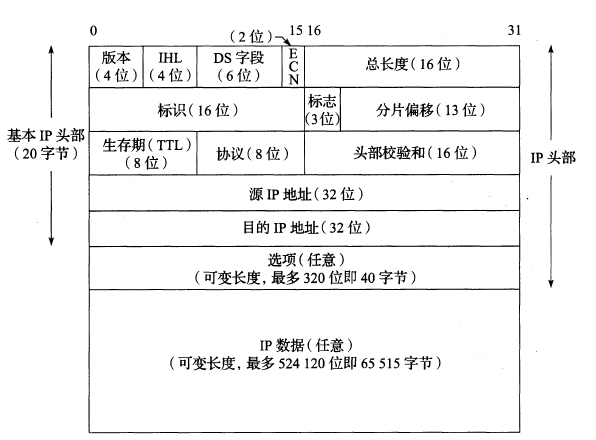
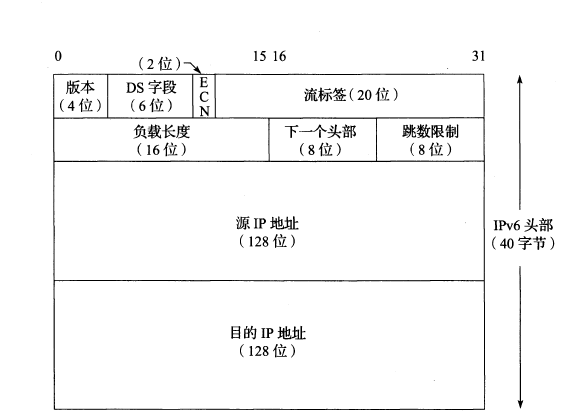

# IP协议

提供了一种不可靠、无连接的数据报交付服务。

* 不可靠：不保证IP数据报能成功到达目的地。任何可靠性必须由上层协议提供
* 无连接：不维护网络单元中数据报相关的任何链接状态信息，每个数据报独立于其他数据报来处理

网络字节序，大端法，高位优先

## IPv4首部

* 版本: 有 4（IPv4）和 6（IPv6）两个值
    >IPv4头部和IPv6头部除版本字段位置相同外再无其他是一样的。因此,这两个协议不能直接互操作,主机或路由器必须分别处理IPv4或IPv6
* IHL(首部长度): 以32bit为单位，也就是4字节。占4位，最大值为15，即60字节。固定部分长度为20字节，因此该值最小为5。如果可选字段的长度不是4字节的整数倍，就用尾部的填充部分来填充。
* DS(区分服务) : 占6位
* ECN(显示拥塞通知):占2位，一般和DS一起用于数据报转发时的特殊处理
    >当通过一台具有内部排队流量的路由器时,头部中的2位ECN位用于为数据报标记拥塞标识符。一台持续拥塞的具有ECN感知能力的路由器在转发分组时会设置这两位。这种功能的设计思路是,当一个被标记的分组被目的节点接收时,有些协议(例如TCP)会发现分组被标记并将这种情况通知发送方,发送方随后会降低发送速度,这样可在路由器因过载而被迫丢弃流量之前缓解拥塞。这种机制是避免或处理网络拥塞的方法之一
* 总长度:包括首部长度和数据部分长度，以字节为单位。(16bit，首部+数据，所以IPv4数据报的最大大小是65535字节）。和IHL字段配合可以知道数据报的数据部分从哪里开始以及数据报的长度。
    >以太网的最小帧长为46字节，但IP数据可能更短，如果没有总长度字段，IP层就无法分辨46字节里有多少是填充的数据，有多少是实际的IP数据报
* 标识: 用于标识主机发送的每一份数据报，每发送一份报文它的值就会加1。在数据报长度过长从而发生分片的情况下，相同数据报的不同分片具有相同的标识符。
    > 即使标识相同，如果目标地址，源地址或协议不同的话，也认为是不同的分片
* 标志：最后一个分片的标志为0，其余分片的标志为1（设置DF位表示不允许分片，可用于路径MTU发现）
* 分片偏移 : 和标识符一起，用于发生分片的情况。片偏移的单位为 8 字节。
* TTL(生存时间)：用于设置一个数据报可经过的路由器数量的上限。
    >它的存在是为了防止无法交付的数据报在互联网中不断兜圈子。以路由器跳数为单位，当 TTL为 0 时就丢弃数据报，并会发送一个ICMP消息通知发送方。
* 协议：包含一个数字，表示数据报有效载荷部分的数据类型，指出携带的数据应该上交给哪个协议进行处理，常见值有TCP(6)、UDP(17) 等。
* 首部检验和：16位。仅仅计算IP头部，因为数据报每经过一个路由器，都要重新计算检验和，因此检验和不包含数据部分可以减少计算的工作量
    >IPv6头部没有任何校验和字段。理由大致如下:在IP头部中,更高层协议为确定正确性,必须计算它们自己的校验和,这需要涵盖它们认为重要的数据。IP头部中的错误带来的后果是数据被投递到错误的目的地、指示数据来源错误,或在交付过程中错位。由于位错误比较少见(受益于Intemet流量的光纤传输),而且其他字段提供了更有力的确保正确性的机制(更高层次的校验和或其他检查),困此决定从IPv6头部中删除这个字段
* 源地址：发送端IP地址，32比特4字节
* 目的地址
* 可选项
* 填充

### 校验和的计算和验证方法

* 首先将数据报的校验和字段值设置为0
* 对首部以16bit为单位求和
* 将产生的进位加到低四位
* 将各位取反，得到最终的校验和
    >举个实际的例子  
    >45 00 00 2e----4表示ip版本号为ip第4版；5表示首部长度为5个32 bit字长，即为20字节；00 2e表示ip总长度为46字节，其中ip数据部分为26字节。  
    >be 55 00 00----be55表示标识符；00 00表示3 bit标志及13 bit片偏移量；  
    >7a 11 51 ac----7a 表示ttl值为122；11表示协议号为17的udp协议；51ac表示16bit首部检验和值  
    >de b7 7e e3----表示32 bit 源ip地址为222.183.126.227  
    >c0 a8 12 7a----表示32 bit 目的ip地址为192.168.18.122  
    >先将校验和字段置为零，即51ac置为零
    > 然后求和0x4500 + 0x002e + 0xbe55 +0x0000 +...+0x127a = 0x3ae50
    > 将产生的进位加到低四位，即checksum += (checksum >> 32),得到0xae53
    > 最后取反，得到0x51ac
* 收到IP数据报后，同样对首部以16bit为单位求和
* 如果没有差错，会得到0xffff，取反得到0x0000
* 当发现一个头部出错(计算的校验和不为0)时, IPv4实现将丢弃接收到的数据报

### DS字段详解

DiffServ

### IP选项

## IPv6首部

* 版本，DS，ECN字段和IPv4含义一致
* 负载长度: 16位，提供IPv6数据报的长度，不包括头部的长度，但是包括扩展头部的长度
* 下一个头部字段：用于说明IPv6头部之后其他扩展头部的存在和类型,它们形成一条包括特殊扩展或处理指令的头部链。应用数据跟在这条头部链之后

## IP转发(路由选择)

* 基本机制
  * 如果目的地是直接相连的主机(例如点到点链接)或共享网络(例如以太网), IP数据报直接发送到目的地,不需要或者不使用路由器。
  * 否则,主机将数据报发送到一台路由器(称为默认路由器),由该路由器将数据报交付到目的

`主机与路由器处理IP数据报的区别在于:主机不转发那些不是由它生成的数据报,但是路由器会这样做`

* 当一个网络接口接收到一个数据报时, IP模块首先检查目的地址是否为本机的的IP地址之一或者IP广播或组播地址。
  * 如果是的话,数据报交付给由IPv4头部的协议字段或IPv6头部的下一个头部字段指定的协议模块。
  * 如果数据报的目的地不是这些地址,那么: (1)如果IP层配置为一台路由器,则转发该数据报(也就是说,作为一个输出的数据报处理); (2)数据报被默默地丢弃。在某些情况下(例如在情况1中没有路由), ICMP消息可能发送回源节点,以表明发生了一个错误

### 路由表(转发表)

* IP层在内存中有一个路由表，每次转发一个数据报时需要从中查找信息。  
* 路由表中包含的关键信息
  * 目的IP地址。
  * 下一跳
  * 接口

# DHCP

# ICMP