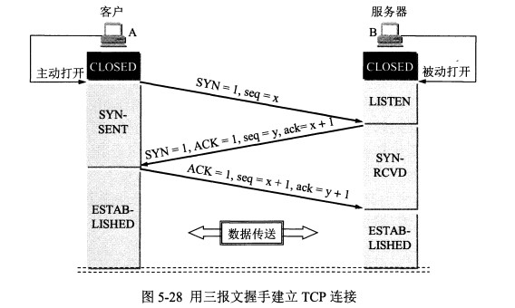

# 目录
* [概述](#概述)
* [应用层](#应用层)
* [传输层](#传输层)
* [网络层](#网络层)
    * [IP](#IP)
    * [IP协议相关技术](#IP协议相关技术)
* [数据链路层](#数据链路层)
* [物理层](#物理层)

[部分面经](https://www.nowcoder.com/discuss/241129?type=2)

[TCP粘包](https://blog.csdn.net/pi9nc/article/details/17165171)
---------------
# 分层协议

共7层

* 物理层: 通过媒介传输比特,确定机械及电气规范,传输单位为bit，主要包括的协议为：IEE802.3 CLOCK RJ45 
* 数据链路层: 将比特组装成帧和点到点的传递,传输单位为帧,主要包括的协议为MAC VLAN PPP 
* 网络层：负责数据包从源到宿的传递和网际互连，传输单位为包,主要包括的协议为IP ARP ICMP 
* 传输层：提供端到端的可靠报文传递和错误恢复，传输单位为报文,主要包括的协议为TCP UDP 
* 会话层：建立、管理和终止会话，传输单位为SPDU，主要包括的协议为RPC NFS 
* 表示层: 对数据进行翻译、加密和压缩,传输单位为PPDU，主要包括的协议为JPEG ASII 
* 应用层: 允许访问OSI环境的手段,传输单位为APDU，主要包括的协议为FTP HTTP DNS 

-----------------------------------------
# 应用层

## 电子邮件协议
一个电子邮件系统由三部分组成：用户代理、邮件服务器以及邮件协议。  
邮件协议包含发送协议和读取协议，发送协议常用 SMTP，读取协议常用 POP3 和 IMAP。  
* SMTP  
SMTP 只能发送 ASCII 码，而互联网邮件扩充 MIME 可以发送二进制文件。MIME 并没有改动或者取代 SMTP，而是增加邮件主体的结构，定义了非 ASCII 码的编码规则
* POP3  
POP3 的特点是只要用户从服务器上读取了邮件，就把该邮件删除。
* IMAP  
IMAP 协议中客户端和服务器上的邮件保持同步，如果不手动删除邮件，那么服务器上的邮件也不会被删除。IMAP这种做法可以让用户随时随地去访问服务器上的邮件。

## DNS(域名系统)
* DNS运行于UDP之上，使用53号端口
* 提供的服务
    * 主机名到IP地址的转换(主要)
    * 主机别名：有着复杂主机名的主机可以拥有一个或多个别名，应用程序可以调用DNS来获得主机别名对应的规范主机名以及主机的IP地址
    * 邮件服务器别名：qq.com与foxmail.com，DNS可以解析邮件服务器别名获得规范名和IP地址
    * 负载分配：繁忙的站点被冗余分布在多台服务器上，这些服务器有不同IP地址，IP地址集合对应于一个规范主机名，当客户机通过主机名获取IP地址时，DNS服务器用包含全部这些地址的报文进行回答，但在每个回答中选择这些地址排放的顺序，从而将负载分配到不同服务器
https://zhuanlan.zhihu.com/p/79350395

-----------------------------------------------------------
# 传输层
## 端口
* 用于识别同一台计算机中进行通信的不同应用程序
* 扩展
    * MAC地址用来识别同一链路中不同的计算机
    * IP地址用于识别TCP/IP网络中互连的主机和路由器
* 用五个信息识别一个通信：源IP地址，目标IP地址，协议号，源端口号，目标端口号
* 三类端口号
    * 0-1023：知名端口号
    * 1024-49151： 注册端口号
    * 49152-65536： 动态分配的端口号
* 确定端口号的方法
    * 静态方法：每个程序都有其指定的端口号
    * 动态方法：操作系统为每个应用程序分配互不冲突的端口号

## TCP和UDP区别
* TCP面向连接（三次握手），通信前需要先建立连接；UDP面向无连接，通信前不需要连接。
* TCP通过序号、重传、流量控制、拥塞控制实现可靠传输；UDP不保障可靠传输，尽最大努力交付。
* TCP面向字节流传输，因此可以被分割并在接收端重组；UDP面向数据报传输。
* 每一条TCP连接只能是点对点的（一对一），UDP支持一对一、一对多、多对一和多对多的交互通信。
* TCP首部开销大，首部20个字节。 UDP首部开销小，8字节。（源端口，目的端口，数据长度，校验和） 
* 若通信数据完整性需让位与通信实时性，则应该选用TCP 协议（如文件传输、重要状态的更新等）；反之，则使用 UDP 协议（如视频传输、实时通信等）。

## UDP
* User Datagram Protocol
* UDP能提供运输层最低限度的两个服务：差错检测、数据交付
* 将应用程序发来的数据在收到的那一刻，立即按照原样发送到网络上
* 常用场景
    * 包总量较少的通信(DNS, SNMP)
    * 视频，音频等多媒体通信
    * 限定于LAN等特定网络中的应用通信
    * 广播通信

### UDP首部

* UDP首部只有4个字段，每个字段2个字节，一共8个字节大小, 包括源端口、目的端口、长度、检验和
* 校验和：对报文段中的所有16比特字（包括数据部分，不包括校验和本身）的和相加（如有溢出会卷回）的结果取反就是校验和。在接收方，会将所有16比特字的和相加，如果分组无差错，这个和会是“1111111111111111”(0xFFFF)

### udp调用connect
* 可以给UDP套接字调用connect，然而这样做的结果却与TCP连接不同的是没有三路握手过程。内核只是检查是否存在立即可知的错误，记录对端的IP地址和端口号，然后立即返回调用进程。
* 一旦UDP套接字调用了connect系统调用，那么这个UDP上的连接就变成一对一的连接，但是通过这个UDP连接传输数据的性质还是不变的，仍然是不可靠的UDP连接。一旦变成一对一的连接，在调用系统调用发送和接受数据时也就可以使用TCP那一套系统调用了。
* 我们再也不能给输出操作指定目的IP地址和端口号。也就是说，我们不使用sendto，而改用write或send。写到已连接UDP套接字上的任何内容都自动发送到由connect指定的协议地址。可以给已连接的UDP套接字调用sendto，但是不能指定目的地址。sendto的第五个参数必须为空指针，第六个参数应该为0. 
* 不必使用recvfrom以获悉数据报的发送者，而改用read、recv或recvmsg。在一个已连接UDP套接字上，由内核为输入操作返回的数据报只有那些来自connect指定协议地址的数据报。这样就限制一个已连接UDP套接字能且仅能与一个对端交换数据报。 
* 由已连接UDP套接字引发的异步错误会返回给它们所在的进程，而未连接的UDP套接字不接收任何异步错误。 

## TCP
### TCP首部

* 20字节的固定大小
* 源端口号，目的端口号，共4字节
* 序号：TCP的序号是数据流中的字节数，不是分组的序号。表示该报文段数据字段首字节的序号，4字节
* 确认号：TCP使用累积确认，确认号是第一个未收到的字节序号，表示希望接收到的下一个字节，4字节
* 首部长度：通常选项字段为空，所以一般TCP首部的长度是20字节
* (可选与变长的)选项字段：用于发送方与接收方协商MSS(最大报文段长)，或在高速网络环境下用作窗口调节因子
* 标志字段 
    * ACK: 指示确认字段中的值是有效的
    * RST,SYN,FIN：连接建立与拆除
    * FIN: 用来释放一个连接，当 FIN=1 时，表示此报文段的发送方的数据已发送完毕，并要求释放连接。
    * PSH：指示接收方应立即将数据交给上层
    * URG：报文段中存在着(被发送方的上层实体置位)“紧急”的数据
* 接收窗口：用于流量控制（表示接收方还有多少可用的缓存空间）
* 校验和
* 紧急指针

### TCP状态转化图

### 三次握手

1. Client将标志位SYN置为1，随机产生一个值seq=J，并将该数据包发送给Server，Client进入SYN_SENT状态，等待Server确认。 
2. Server收到数据包后由标志位SYN=1知道Client请求建立连接，Server将标志位SYN和ACK都置为1，ack=J+1，随机产生一个值seq=K，并将该数据包发送给Client以确认连接请求，Server进入SYN_RCVD状态,为该TCP连接分配TCP缓存和变量。 
3. Client收到确认后，检查ack是否为J+1，ACK是否为1，如果正确则将标志位ACK置为1，ack=K+1，为该连接分配缓存和变量,并将该数据包发送给Server，Server检查ack是否为K+1，ACK是否为1，如果正确则连接建立成功，Client和Server进入ESTABLISHED状态。

**如果客户端不发送ACK来完成第三次握手，最终(通常是一分钟后)服务器将终止该半开连接并回收已分配的资源（在第三次握手前分配缓存和变量，可能会受到SYN洪泛攻击）**

**第三次握手是为了防止失效的连接请求到达服务器，让服务器错误打开连接。**
客户端发送的连接请求如果在网络中滞留，那么就会隔很长一段时间才能收到服务器端发回的连接确认。客户端等待一个超时重传时间之后，就会重新请求连接。但是这个滞留的连接请求最后还是会到达服务器，如果不进行三次握手，那么服务器就会打开两个连接。如果有第三次握手，客户端会忽略服务器之后发送的对滞留连接请求的连接确认，不进行第三次握手，因此就不会再次打开连接。

**如果第二次握手丢包怎么办？第三次呢？**  
* 第二个包，即B发给A的SYN +ACK 中途被丢，没有到达A：B会周期性超时重传，直到收到A的确认  
* 第三个包，即A发给B的ACK 中途被丢，没有到达B：A发完ACK，单方面认为TCP为 Established状态，而B显然认为TCP为Active状态 
    * 假定此时双方都没有数据发送：B会周期性超时重传，直到收到A的确认，收到之后B的TCP 连接也为Established状态，双向可以发包
    * 假定此时A有数据发送：B收到A的 Data + ACK，自然会切换为established 状态，并接受A的Data
    * 假定B有数据发送：数据发送不了，会一直周期性超时重传SYN + ACK，直到收到A的确认才可以发送数据

**SYN cookies预防SYN洪泛攻击：**
    * 当服务器接收到一个SYN报文段时，它并不知道该报文段是来自一个合法的用户，还是一个SYN洪泛攻击的一部分。因此服务器不会为该报文段生成一个半开TCP连接。相反，服务器生成一个初始TCP序列号y，该序列号是SYN报文段的源和目的IP地址、端口号以及仅被该服务器所知的秘密数的一个散列函数，这种精心制作的初始序列号被称作“cookie”。服务器发送具有这种特殊序列号的SYNACK分组，服务器并不记忆该cookie或任何对应于SYN的其他状态信息
    * 如果客户机是合法的，它将返回一个ACK报文段。服务器一旦收到该ACK，需要验证与前面发送的某些SYN对应的ACK。对于一个合法的ACK，确认字段中的值等于SYNACK序号字段y的值加1。服务器将使用在ACK报文段中的相同字段和秘密数运行相同的函数。如果该函数的结果加1与确认号相同，服务器就认为该ACK对应于前面发送的SYN报文段，生成一个具有套接字的全开的连接
    * 如果客户机没有返回一个ACK报文段，则初始化的SYN也没有对该服务器产生危害，因为服务器没有为它分配任何资源

### 四次挥手

1. 数据传输结束后，客户端的应用进程发出连接释放报文段，并停止发送数据，客户端进入FIN_WAIT_1状态，此时客户端依然可以接收服务器发送来的数据。 
2. 服务器接收到FIN后，发送一个ACK给客户端，确认序号为收到的序号+1，服务器进入CLOSE_WAIT状态。客户端收到后进入FIN_WAIT_2状态。 
3. 当服务器没有数据要发送时，服务器发送一个FIN报文，此时服务器进入LAST_ACK状态，等待客户端的确认 
4. 客户端收到服务器的FIN报文后，给服务器发送一个ACK报文，确认序列号为收到的序号+1。此时客户端进入TIME_WAIT状态，等待2MSL（MSL：报文段最大生存时间），然后关闭连接。 

**为什么需要四次**  
* TCP是全双工的，它允许两个方向的数据传输被独立关闭。当主动发起关闭的一方关闭连接之后，TCP进入半关闭状态，此时主动方可以只关闭输出流。
* 之所以不是三次而是四次主要是因为被动关闭方将"对主动关闭报文的确认"和"关闭连接"两个操作分两次进行。
* 对主动关闭报文的确认是为了快速告知主动关闭方，此关闭连接报文已经收到。此时被动方不立即关闭连接是为了将缓冲中剩下的数据从输出流发回主动关闭方（主动方接收到数据后同样要进行确认），因此要把"确认关闭"和"关闭连接"分两次进行。

**2MSL意义：** 
* 保证最后一次握手报文能到B，能进行超时重传。 
* 2MSL后，这次连接的所有报文都会消失，不会影响下一次连接。
* MSL(最长分节生命期)是任何IP数据报能够在因特网中存活的最长时间（IP数据报中的TTL首部为8位，具有最大TTL，即255的分组，在网络中存在的时间不能超过MSL）。任何TCP实现都必须为MSL选择一个值。RFC 1122的建议值是2分钟，不过源自Berkeley的实现传统上改用30秒。意味着TIME_WAIT状态的持续时间在1分钟到4分钟之间

### 可靠传输
* 序列号
    * 按顺序给发送数据的每个字节都标上号码的编号，接收端查询接收数据TCP首部中的序列号和数据的长度，将自己下一步应该接收的序列号作为确认应答返回
* 确认应答、超时重传 
    * 当发送端的数据到达接收主机时，接收端主机会返回一个已收到消息的通知，叫做ACK
    * 如果一个已经发送的报文段在超时时间内没有收到确认，那么就重传这个报文段。  
    * 一个报文段从发送再到接收到确认所经过的时间称为往返时间 RTT
    * 每次发包时都会计算往返时间和偏差，得到超时重传时间
    * 数据被重发后若还是接收不到确认应答，则会被再次发送，此时等待确认应答的时间将会以指数函数增长，达到一定的重发次数后会判断为网络或对端主机发生异常，强制关闭连接
* 数据合理分片和排序
    * MSS:最大消息长度，在IP层中不会被分片处理的最大数据长度。三次握手阶段时，在两端主机之间被计算得出
    * 在传送大量数据时，以MSS的大小将数据进行分割发送
    * 接收方会缓存未按序到达的数据，重新排序后再交给应用层
* 滑动窗口控制
    * 为了提高数据发送效率，发送端主机在发送了一个段以后不必要一直等待确认应答，而是继续发送
    * 窗口大小就是只无需等待确认应答而可以继续发送数据的最大值
* 流量控制
    * 当接收方来不及处理发送方的数据，能提示发送方降低发送的速率，防止包丢失。
    * 接收端主机向发送端主机通知自己可以接收数据的大小，TCP首段中有专门这一个字段
    * 同时发送端主机会时不时的发送一个叫窗口探测的数据段，此数据段仅含有一个字节以获取最新的窗口大小信息
* 拥塞控制：当网络拥塞时，减少数据的发送。

### 流量控制
如果应用程序读取数据相当慢，而发送方发送数据太多、太快，会很容易使接收方的接收缓存溢出，流量控制就是用来进行发送速度和接收速度的匹配。发送方维护一个“接收窗口”变量，这个变量表示接收方当前可用的缓存空间
* LastByteRead:接收方应用程序从接收缓存中读取的最后一个字节
* LastByteRcvd:接收方接收到的最后一个字节

这个方案存在一个问题，当接收方缓存已满时，将RcvWindow=0通告给发送方，并且接收方没有任何数据要发送给发送方，随着接收方应用进程清空缓存，TCP并不向发送方发送带有RcvWindow新值的新报文段；TCP仅在它有数据或确认要发送时才会发送报文段。这样，发送方不会知道接收方缓存已经有新的空间，发送方因此被阻塞而不能再发送数据。为解决这个问题，TCP规约中要求：当接收方的接收窗口为0时，发送方继续发送只有1个字节数据的报文段。这些报文段将会被接收方确认。最终缓存将开始清空，并且确认报文里将包含一个非0的RcvWindow值

### 拥塞控制
* 拥塞控制分类
    * 端到端拥塞控制：网络层没有为运输层拥塞控制提供显示支持（TCP的拥塞控制）
    * 网络辅助的拥塞控制：网络层组件向发送方提供关于网络中拥塞状态的显式反馈信息（ATM ABR）

**由于IP层不向端系统提供显示的网络拥塞反馈，所以TCP必须使用端到端拥塞控制，而不是网络辅助拥塞控制**

  

* 慢启动：定义拥塞窗口，一开始将该窗口大小设为1，之后每次收到确认应答（经过一个rtt），将拥塞窗口大小*2。 
* 拥塞避免：设置慢启动阈值，一般开始都设为65536。拥塞避免是指当拥塞窗口大小达到这个阈值，拥塞窗口的值不再指数上升，而是加法增加（每次确认应答/每个rtt，拥塞窗口大小+1），以此来避免拥塞。 将报文段的超时重传看做拥塞，则一旦发生超时重传，我们需要先将阈值设为当前窗口大小的一半，并且将窗口大小设为初值1，然后重新进入慢启动过程。 
* 快速重传：在遇到3次重复确认应答（高速重发控制）时，代表收到了3个报文段，但是这之前的1个段丢失了，便对它进行立即重传。 
然后，先将阈值设为当前窗口大小的一半，然后将拥塞窗口大小设为慢启动阈值+3的大小。 

### TCP粘包
* TCP（transport control protocol，传输控制协议）是面向连接的，面向流的，提供高可靠性服务。收发两端（客户端和服务器端）都要有一一成对的socket，因此，发送端为了将多个发往接收端的包，更有效的发到对方，使用了优化方法（Nagle算法），将多次间隔较小且数据量小的数据，合并成一个大的数据块，然后进行封包。这样，接收端，就难于分辨出来了，必须提供科学的拆包机制。 即面向流的通信是无消息保护边界的。
* UDP（user datagram protocol，用户数据报协议）是无连接的，面向消息的，提供高效率服务。不会使用块的合并优化算法，, 由于UDP支持的是一对多的模式，所以接收端的skbuff(套接字缓冲区）采用了链式结构来记录每一个到达的UDP包，在每个UDP包中就有了消息头（消息来源地址，端口等信息），这样，对于接收端来说，就容易进行区分处理了。 即面向消息的通信是有消息保护边界的。
* TCP接收到分组时，并不会立刻送至应用层处理，或者说，应用层并不一定会立即处理；实际上，TCP将收到的分组保存至接收缓存里，然后应用程序主动从缓存里读收到的分组。这样一来，如果TCP接收分组的速度大于应用程序读分组的速度，多个包就会被存至缓存，应用程序读时，就会读到多个首尾相接粘到一起的包。
* 解决方法
    * 发送方，对于发送方造成的粘包现象，我们可以通过关闭Nagle算法来解决，使用TCP_NODELAY选项来关闭Nagle算法。
② 接收方
遗憾的是TCP并没有处理接收方粘包现象的机制，我们只能在应用层进行处理。
③ 应用层处理
应用层的处理简单易行！并且不仅可以解决接收方造成的粘包问题，还能解决发送方造成的粘包问题。

### Nagle算法
* 发送端即使还有应该发送的数据，但如果这部分数据很少的话，则进行延迟发送
* 只有在下列任意一种条件满足时才能发送数据
    * 已发送的数据都已经收到了确认应答
    * 可以发送最大报文段长度MSS的数据时
* 可以提高网络利用率，但是会造成延迟

### 延迟确认应答
* 收到数据后并不立即返回确认应答，而是延迟一段时间

## 其他传输层协议
* UDP-Lite
    * 提供与UDP几乎相同的功能，不过计算校验和的范围可以由应用自行决定
    * 可以只针对不允许发生错误的部分进行校验和的检查，对于其他部分，即使发生了错误，也会忽略不计
* SCTP
* DCCP
----------------------------------------------
# 网络层

## IP

### IPv4地址
* 32位二进制数
* 每8位为一组，分成4组，每组以"."隔开，再将每组数转换成十进制数
* 通常一块网卡只配置一个IP地址，但一块网卡可以配置多个IP地址
* 由“网络标识(地址)”和“主机标识(地址)”两部分组成
    * 

### IP首部

* 版本 : 有 4（IPv4）和 6（IPv6）两个值；
* 首部长度 : 占 4 位，因此最大值为 15。值为 1 表示的是 1 个 32 位字的长度，也就是 4 字节。因为固定部分长度为 20 字节，因此该值最小为 5。如果可选字段的长度不是 4 字节的整数倍，就用尾部的填充部分来填充。
* 区分服务 : 用来获得更好的服务，一般情况下不使用。
* 总长度 : 包括首部长度和数据部分长度。（16bit，首部+数据，所以IPv4数据报的最大大小是65535字节）
* 生存时间 ：TTL，它的存在是为了防止无法交付的数据报在互联网中不断兜圈子。以路由器跳数为单位，当 TTL为 0 时就丢弃数据报。
* 协议 ：指出携带的数据应该上交给哪个协议进行处理，例如 ICMP、TCP、UDP 等。
* 首部检验和 ：因为数据报每经过一个路由器，都要重新计算检验和，因此检验和不包含数据部分可以减少计算的工作量。
* 标识 : 在数据报长度过长从而发生分片的情况下，相同数据报的不同分片具有相同的标识符。即使标识相同，如果目标地址，源地址或协议不同的话，也认为是不同的分片
* 片偏移 : 和标识符一起，用于发生分片的情况。片偏移的单位为 8 字节。
* 标志：最后一个分片的标志为0，其余分片的标志为1（设置DF位表示不允许分片，可用于路径MTU发现）
* 源地址：发送端IP地址，32比特4字节
* 目的地址
* 可选项
* 填充

## 数据报分片
一个链路层帧能承载的最大数据量叫做最大传输单元(MTU)（以太网可承载不超过1500字节的数据），因为每个IP数据报封装在链路层帧中，再从一台路由器运输到下一台路由器，故链路层协议MTU严格地限制着IP数据报的长度。发送方与目的地路径上的每段链路可能使用不同的链路层协议，每种协议可能具有不同的MTU，如果转发表查找决定的出链路的MTU比该IP数据报的长度小，则需要对IP数据报进行分片。片在到达目的地运输层以前需要被组装，如果一个或多个片没有到达目的地，则该不完整的数据报被丢弃
分片可以通过4.2中介绍的IP数据报中的标识、标志、比特片偏移来识别

### 子网掩码
* 子网掩码是一种用来指明一个IP地址所标示的主机处于哪个子网中。
* 子网掩码不能单独存在，它必须结合IP地址一起使用。
* 子网掩码只有一个作用，就是将某个IP地址划分成网络地址和主机地址两部分。

### IPv6
* 为了根本解决IPv4地址耗尽问题而被标准化的国际协议，同时试图弥补IPv4中的绝大多数缺陷
* 

## IP协议相关技术

### ARP 地址解析协议 
提供将IP地址转换为链路层地址的机制     
每个主机都有一个 ARP 高速缓存，里面有本局域网上的各主机和路由器的 IP 地址到 MAC 地址的映射表。  
如果主机 A 知道 IP 地址，但是 ARPP 地址到 MAC 地址的映射，此时主机 A  高速缓存中没有该 I通过广播的方式发送 ARP 请求分组，主机 B 收到该请求后会发送 ARP 响应分组给主机 A 告知其 MAC 地址，随后主机 A 向其高速缓存中写入主机 B 主机 B 的的 IP 地址到 MAC 地址的映射  
ARP高速缓存表在IP层使用。如果每次建立TCP连接都发送ARP请求，会降低效率，因此在主机、交换机、路由器上都会有ARP缓存表。建立TCP连接时先查询ARP缓存表，如果有效，直接读取ARP表项的内容进行第二层数据包的发送；只有表失效时才进行ARP请求和应答进行MAC地址的获取，以建立TCP连接

**ARP作用**  
（1）TCP/IP的32bit IP地址。仅知道主机的IP地址不能让内核发送数据帧给主机。
（2）网络接口的硬件地址，它是一个48bit的值，用来标识不同的以太网或令牌环网络接口。在硬件层次上，进行数据交换必须有正确的接口地址，内核必须知道目的端的硬件地址才能发送数据。
简言之，就是在以太网中，一台主机要把数据帧发送到同一局域网上的另一台主机时，设备驱动程序必须知道以太网地址才能发送数据。而我们只知道IP地址，这时就需要采用ARP协议将IP地址映射为以太网地址

**一般认为ARP协议只使适用于局域网** 
如果目的IP地址和自己不在同一个网段，就需要将包发送给默认网关(网关是默认的数据出口)，这需要知道默认网关的MAC地址 ,ARP用于查找默认网关

### ICMP 网际控制报文协议 
ICMP用于主机和路由器彼此交互网络层信息。最典型的用途是差错报告，但其用途不仅限于此(如源抑制，用于拥塞控制)  
ICMP通常被认为是IP的一部分，但从体系结构上讲，它是位于IP之上，因为ICMP报文承载在IP分组中，作为IP有效载荷  
* Ping  
Ping 是 ICMP 的一个重要应用，主要用来测试两台主机之间的连通性。
Ping 的原理是通过向目的主机发送 ICMP Echo 请求报文，目的主机收到之后会发送 Echo 回答报文。Ping 会根据时间和成功响应的次数估算出数据包往返时间以及丢包率。
* Traceroute   
Traceroute是 ICMP 的另一个应用，用来跟踪一个分组从源点到终点的路径。
Traceroute 发送的 IP 数据报封装的是无法交付的 UDP 用户数据报，并由目的主机发送终点不可达差错报告报文。
源主机向目的主机发送一连串的 IP 数据报。第一个数据报 P1 的生存时间 TTL 设置为 1，当 P1 到达路径上的第
一个路由器 R1 时，R1 收下它并把 TTL 减 1，此时 TTL 等于 0，R1 就把 P1 丢弃，并向源主机发送一个 ICMP
时间超过差错报告报文；
源主机接着发送第二个数据报 P2，并把 TTL 设置为 2。P2 先到达 R1，R1 收下后把 TTL 减 1 再转发给 R2，R2
收下后也把 TTL 减 1，由于此时 TTL 等于 0，R2 就丢弃 P2，并向源主机发送一个 ICMP 时间超过差错报文。
不断执行这样的步骤，直到最后一个数据报刚刚到达目的主机，主机不转发数据报，也不把 TTL 值减 1。但是
因为数据报封装的是无法交付的 UDP，因此目的主机要向源主机发送 ICMP 终点不可达差错报告报文。
之后源主机知道了到达目的主机所经过的路由器 IP 地址以及到达每个路由器的往返时间。

###  NAT 网络地址转换
NAT适用这样一种场景：由于每个IP使能的设备都需要一个IP地址，如果一个子网已经获得了一块IP地址，当连入设备增加时，IP地址可能不足

NAT使能路由器对外界的行为就像一个具有单一IP地址的单一设备，通过端口号来标识一个使用专用地址的设备
当专用设备与外界通信时，NAT使能路由器为其生成一个新的源端口号，并使用连入广域网一侧接口的IP地址作为源地址发送数据报，同时会将这个映射关系记录在NAT转换表中
当有数据报到达时，NAT使能路由器通过查找NAT转换表中的映射关系，改写目的IP和端口号，向专用网络转发数据报

在以前，NAT 将本地 IP 和全球 IP 一一对应，这种方式下拥有 n 个全球 IP 地址的专用网内最多只可以同时有 n 台主机接入互联网。为了更有效地利用全球 IP 地址，现在常用的 NAT 转换表把传输层的端口号也用上了，使得多个专用网内部的主机共用一个全球 IP 地址。使用端口号的 NAT 也叫做网络地址与端口转换 NAPT。

##  DHCP 动态主机配置协议
DHCP (Dynamic Host Configuration Protocol) 提供了即插即用的连网方式，用户不再需要手动配置IP地址等信息。
* 提供的服务
    * 为主机分配IP地址
    * 获取子网掩码
    * 获取第一跳路由器地址（常称为默认网关）
    * 提供本地DNS服务器的地址（记录在/etc/resolv.conf文件中）
* 步骤
    * DHCP服务器发现：新到的客户端在68号端口使用UDP广播(255.255.255.255)DHCP发现报文，源地址为0.0.0.0
    * DHCP服务器提供：子网中收到DHCP请求报文的DHCP服务器使用DHCP提供报文作出响应，提供IP地址、网络掩码、IP地址租用期(通常设置为几个小时或几天)
    * DHCP请求：客户端从多个服务器的响应中选择一个，并用一个DHCP请求报文对选中的服务器进行响应，回显配置参数（这一步目的地址使用广播地址是因为在DHCP服务器提供时，服务器为客户预分配了IP地址，因此，客户有责任通知不采用的服务器，好让它们释放预分配的地址）
    * DHCP ACK：服务器用DHCP ACK报文对DHCP请求报文进行响应，证实所要求的参数
* 不足之处  
    DHCP有不足之处：每当一个节点连到一个新子网时，都要从DHCP得到一个新的IP地址，这样当一个移动节点在子网直接移动时，就不能维持与远程应用之间的连接。移动IP是一种对IP基础设施的扩展，允许移动节点在子网之间移动时能使用其单一永久的地址

## 路由器
### 路由器功能
能识别IP地址并根据IP地址转发分组。维护着路由表，根据路由表选择最佳路线。  
路由选择与分组转发  
* 分组转发流程
    * 从数据报的首部提取目的主机的 IP 地址 D，得到目的网络地址 N。
    * 若 N 就是与此路由器直接相连的某个网络地址，则进行直接交付；
    * 若路由表中有目的地址为 D 的特定主机路由，则把数据报传送给表中所指明的下一跳路由器；
    * 若路由表中有到达网络 N 的路由，则把数据报传送给路由表中所指明的下一跳路由器；
    * 若路由表中有一个默认路由，则把数据报传送给路由表中所指明的默认路由器；
    * 报告转发分组出错。
* 路由选择
    * 路由选择协议都是自适应的，能随着网络通信量和拓扑结构的变化而自适应地进行调整。
    * 可以把路由选择协议划分为两大类：自治系统内部的路由选择：RIP 和 OSPF，自治系统间的路由选择：BGP
    * AS（autonomous system）系统指的是处于一个管理机构控制之下的路由器和网络群组
    * 自治系统AS的经典定义是在单一的技术管理下的一组路由器，而这些路由器使用一种AS内部路由选择协议和共同的度量已确定分组在该AS内的路由，同时还使用一种AS之间的路由选择协议用以确定分组在AS之间的路由

### 内部网关RIP协议
* RIP是一种基于距离向量的路由选择协议。网络中的每一个路由器都要维护从它自己到其他每一个目标网络的距离记录。距离是指跳数，直接相连的路由器跳数为1。跳数最多为15，超过15表示不可达。
* RIP按固定的时间间隔(每隔30秒)和相邻路由器交换自己的路由表，经过若干次交换之后，所有路由器最终会知道到达本自治系统中任何一个网络的最短距离和下一跳路由器地址。
* RIP 协议实现简单，开销小。但是RIP能使用的最大距离为15，限制了网络的规模。并且当网络出现故障时，要经过比较长的时间才能将此消息传送到所有路由器。
* 距离向量算法：
    * 对地址为 X 的相邻路由器发来的 RIP 报文，先修改报文中的所有项目，把下一跳字段中的地址改为 X，并把所有的距离字段加 1；
    * 对修改后的 RIP 报文中的每一个项目，进行以下步骤：
        * 若原来的路由表中没有目的网络 N，则把该项目添加到路由表中；
        * 否则：若下一跳路由器地址是 X，则把收到的项目替换原来路由表中的项目；
        * 否则：若收到的项目中的距离 d小于路由表中的距离，则进行更新（例如原始路由表项为 Net2, 5, P，新表项为 Net2, 4, X，则更新）；否则什么也不做。
        * 若3分钟还没有收到相邻路由器的更新路由表，则把该相邻路由器标为不可达，即把距离置为 16。

### 内部网关协议 OSPF
* 开放最短路径优先 OSPF
* 开放表示 OSPF 不受某一家厂商控制，而是公开发表的；最短路径优先表示使用了 Dijkstra 提出的最短路径算法SPF。
* 向本自治系统中的所有路由器发送信息，这种方法是洪泛法。
* 发送的信息就是与相邻路由器的链路状态，链路状态包括与哪些路由器相连以及链路的度量，度量用费用、距离、时延、带宽等来表示。
* 只有当链路状态发生变化时，路由器才会发送信息。
* 所有路由器都具有全网的拓扑结构图，并且是一致的。相比于 RIP，OSPF 的更新过程收敛的很快。

### 外部网关协议 BGP
* BGP（Border Gateway Protocol，边界网关协议）
* AS 之间的路由选择很困难，主要是由于：
    * 互联网规模很大；
    * 各个 AS 内部使用不同的路由选择协议，无法准确定义路径的度量；
    * AS 之间的路由选择必须考虑有关的策略，比如有些 AS 不愿意让其它 AS 经过。
* BGP 只能寻找一条比较好的路由，而不是最佳路由。
* 每个AS都必须配置BGP发言人，通过在两个相邻BGP发言人之间建立TCP连接来交换路由信息。

--------------------------------------
# 数据链路层

### 作用
* 定义了通过媒介互连的设备之间传输的规范
* 把比特集合成一个帧，然后再进行传输
* 数据链路是网络传输中的最小单位

### MAC地址
* 用于识别数据链路中互连的结点
* 长48比特，共6字节
    * 第一位：单播地址(0)/多播地址(1)
    * 第二位：全局地址(0)/本地地址(1)
    * 3-24位：厂商识别码，OUI
    * 25-48位： 厂商内部识别码，保证产品之间不重复
* MAC地址不一定是唯一的，即使MAC地址相同，只要不是同属于一个数据链路就不会出现问题

### 共享介质型网络
* 是指多个设备共享一个通信介质的一种网络
* 基本采用半双工通信方式，并有必要对介质进行访问控制，有两种访问方式
* 争用方式
    * 争夺获取数据传输的权力，令网络中的各个站采用先到先得的方式占用信道发送数据
    * 如果多个站同时发送帧，则会产生冲突现象，会导致网络拥堵与性能下降
* 令牌传递方式
    * 沿着令牌环发送一种叫做"令牌"的特殊报文，只有获得令牌的站才能发送数据
    * 不会产生冲突，每个站都有通过平等循环获得令牌的机会，即使网络拥堵也不会造成性能下降

### 非共享介质网络
* 每个站直连交换机，由交换机负责转发数据帧，发送方和接收方不共享通信介质
* 全双工通信
* 一旦交换机发生故障，与之相连的所有计算机之间都将无法通信

--------------------
# 物理层

### 作用
* 通过媒介传输比特,确定机械及电气规范,传输单位为bit
* 把上层的比特流转换成电压的高低、灯光的闪灭等，将数据传输出去
* 接收端收到这些物理信号，并恢复成比特率
* 定义的规范
    * 比特流转换规则
    * 缆线结构和质量
    * 接口形状

### 传输方式
* 模拟方式
    * 通过连续变化的量表示某个量的方法
    * 采集到的是连续变化的值
    * 值有一定的模糊性，在远距离传输中值容易发生变化
* 数字方式
    * 通过除0或1之外没有其他中间值的离散数值表示某个量的方法
    * 将模拟数据经量化后得到的离散的值 
    * 没有含糊不清的值，在较长距离之间传递(可以使用中继器)，数据的值也不易发生变化
    * TCP/IP中全部使用数字通信模式
* 调制解调器,MODEM
    * 用于将模拟信号和数字信号之间的相互转化

### 编码方式
* 曼彻斯特编码
    * 0的时候由高到低
    * 1的时候由低到高
* NRZ
    * 0的时候为高或者为低
    * 1的时候为低或者高
* NRZI
    * 0的时候不变
    * 1的时候变化
    * 出现了连续的0就无法分割不同的比特率，可以使用4B/5B技术，每4个比特数据插入一个附加比特将其置换成一个5比特符号的比特流
* MLT-3
    * 0的时候不变
    * 1的时候变化
    * 和NRZI不同的是有三阶段的变化

### 传输介质
* 同轴电缆
* 双绞线
* 光纤
* 无线
    * 红外
    * 微波