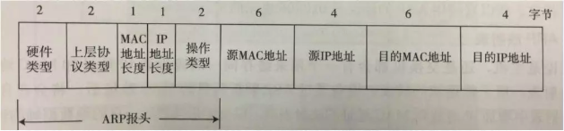
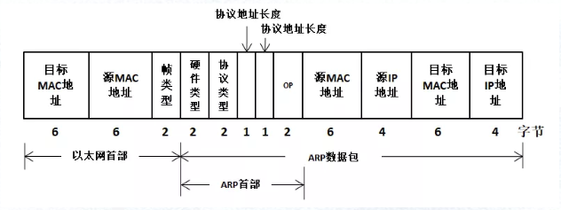

# 链路层

    为IP模块发送和接收IP数据报

`PDU 协议数据单元` 链路层的PDU使用术语 `帧`
`MTU 最大传输单元`
``

## 以太网

    基本的共享以太网包含一个或多个站(例如工作站、超级计算机),它们都被连接到一个共享的电缆段上。
    当介质被确定为空闲状态时,链路层的PDU (帧)可从一个站发送到一个或更多其他站。如果多个站同时发送数据,可能因信号传播延迟而发生碰撞。
    碰撞可以被检测到,它会导致发送站等待一个随机时间,然后重新发送数据。这种常见的方法称为带冲突检测的载波侦听多路访间

带冲突检测的载波侦听多路访问(CSMA)

全双工以太网

## ARP(地址解析协议)

* Address Resolution Protocol
* 提供从网络层地址到硬件地址的映射，通常实现从IP地址到MAC地址的映射

### 原理以及流程

RP是动态处理的，现在总结一下：ARP表项的生存时间是一般为5-10分钟（LwIP中默认是5分钟），而ARP请求的等待时间是5秒钟，当这些时间到达后，就会更新ARP表项，如果在物理链路层无法连通则会删除表项。
因此每个协议栈的实现都必须维护着一个定时器（超时机制）来管理ARP缓存表，在必要的时候更新及删除ARP表项，关于怎么处理的我们就不多追究，有兴趣的可以看LwIP的etharp_tmr()源码

### ARP报文格式

  

* 以太网首部
  * 目标MAC地址：建立ARP表时是FF-FF-FF-FF-FF-FF,表明在同一广播域中的所有以太网接收这些帧
  * 源MAC地址
  * 帧类型: 对于ARP数据包来说，其值为0x0806，
* 硬件类型，标识链路层协议,为1表示以太网地址
* 协议类型，标识网络层协议,对于IP地址，其值为0x0800。
* 硬件地址大小，标识MAC地址长度，这里是6个字节（48bti）
* 协议地址大小，标识IP地址长度，这里是4个字节（32bit）
* 操作代码，标识ARP数据包类型，1表示请求，2表示回应，(RARP请求，其值为3。RARP应答，其值为4)
* 发送者MAC
* 发送者IP
* 目标MAC，在ARP请求中，这个字段设为0
* 目标IP

向局域网中的某个电脑发送一个数据，那么我的电脑就会从已有的ARP缓存表中寻找这个IP地址对应的物理地址的ARP表项，然后直接将数据写入以太网数据帧中让网卡进行发送即可，而如果没有找到这个IP地址，会广播一个ARP请求

先在局域网上广播一个ARP请求（目标MAC地址为FF-FF-FF-FF-FF-FF），广播的ARP请求发出后，处于同一局域网内的所有主机都会接收到这个请求，如果目标IP地址与接收到ARP请求的主机自身IP地址吻合就会返回一个ARP应答，告诉请求者（即我的电脑）自身的MAC地址，当我的电脑收到这个ARP应答后，就去建立一个ARP表项，并且重新将数据发送出去。

当一个系统接收到一个ARP请求.它填充自己的硬件地址，将两个发送地地址和两个接收方地址互换.将Op字段设置为2.然后发送生成的应答。这个应答通常不是广播,而是仅直接发送给请求的发送方。同时,接收ARP请求的主机学习IPv4到MAC地址的映射,并记录在内存中供以后使用

### ARP协议到底处于哪一层？

    协议到底所属哪一层，可以从应用/功能来考虑，也可以从层次/包封装来考虑。  
    以ARP协议为例，它的功能最终是获取到MAC信息，服务于链路层，从这点考虑，ARP是链路层协议；但是从层次来看，ARP基于Ethernet协议，IP协议基于Ethernet协议，它们在Ethernet协议里面有独立的Type类型，前者是0x0806，后者是0x0800，既然ARP和IP协议"平起平坐"，那么IP是网络层，ARP难道就不是网络层？